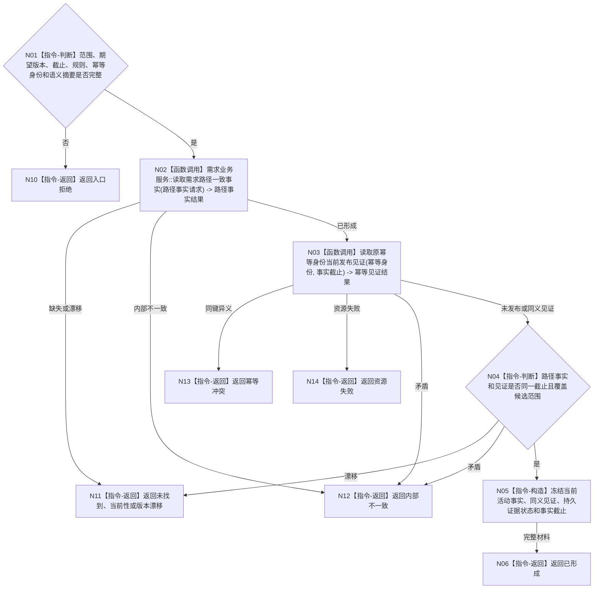

# BIZ-L4-002-06-05-01 读取当前需求活动事实目标函数流程图 v0.1

更新时间：2026-08-03

## 依据

```text
3100、4010—4050、5110、5160；BIZ-L3-002-06-02、BIZ-L3-002-06-05
旧鱼巢可吸收：活动重判写前重新批量读回；排除线程缓存、SQL行和历史最近值补齐
```

## 身份与边界

正式目标函数设计图。读取候选范围内当前活动路径、权重、当前性、父目标比较引用和原幂等发布见证，供写前差异与幂等裁决；不形成候选，不比较父目标，不写事实。

## 函数合同

```text
根函数：需求活动重判数据操作::读取当前需求活动事实
归属模块 / 文件 / 层级：需求活动重判数据操作 / 海中鱼巣/领域/数据操作.需求活动重判.ixx / L4
现有或待新增：待新增内部只读组合；复用BIZ-L3-002-06-02读取路径一致事实
完整签名：需求活动当前事实读取结果 需求活动重判数据操作::读取当前需求活动事实(const 需求活动当前事实读取请求& 请求) const
参数：请求为只读借用；含候选范围、期望需求树版本、事实截止版本、路径规则版本、幂等身份和完整语义摘要
返回结果：调用方拥有的不可变值式结果；含已形成、未找到、当前性漂移、版本漂移、幂等冲突、资源失败或内部不一致，以及当前活动事实、发布见证、持久证据状态和事实截止
被调函数流程图：复用BIZ-L3-002-06-02 `需求业务服务::读取需求路径一致事实`；幂等发布见证读取为数据操作内部业务中性只读，不另建公开领域入口
父图：BIZ-L3-002-06-05
```

## 流程图



## 节点合同

| 节点 | 类型 | 参数 / 输入绑定 | 结果 / 输出绑定 | 事实读写 | 后继条件 | 验证 |
| --- | --- | --- | --- | --- | --- | --- |
| N02 | 函数调用 | 候选范围、截止、规则和需求树版本 -> 路径事实请求 | 路径一致事实 | 只读需求已发布事实 | 已形成或具名非成功 | 复用现有一致读取，不按节点数量推断角色 |
| N03 | 函数调用 | 幂等身份、语义摘要和截止 | 未发布、同义见证或冲突 | 只读发布证据 | 见证状态 | 名称、SQL行或摘要碰撞不足以证明同义 |
| N04/N05 | 指令-判断 / 构造 | 两组同截止材料 | 当前活动事实包 | 无 | 完整、漂移或矛盾 | 活动路径、权重、当前性和父目标引用覆盖候选范围 |
| N06/N10—N14 | 指令-返回 | 读取状态 | 结构化结果 | 无 | 返回 | 缺失、漂移、冲突、资源和内部不一致分离 |

## 关键边界

读取结果是写前值式投影，不是第二权威账。历史活动关系、最近结算、日志、缓存和 SQL 不得补齐当前路径；同键异义是幂等冲突，已发布事实自身矛盾才是内部不一致。

