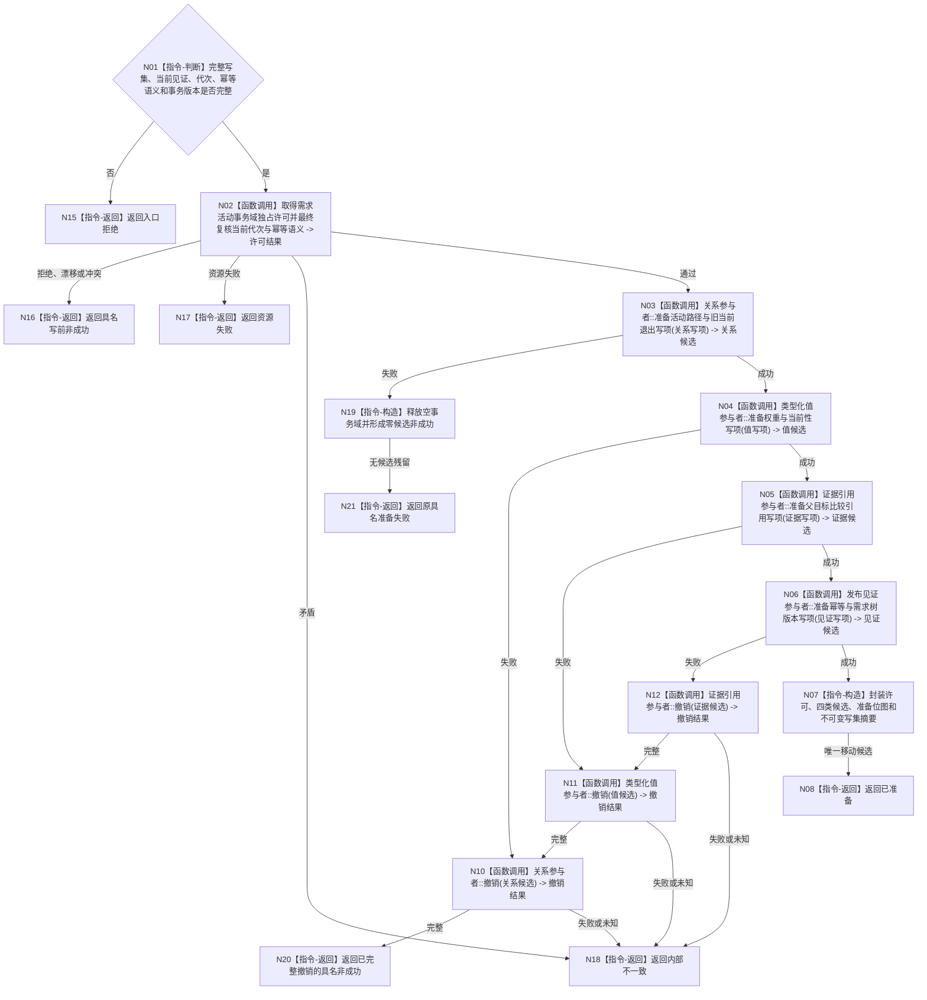

# BIZ-L4-002-06-05-02 准备需求活动重判事务候选目标函数流程图 v0.1

更新时间：2026-08-03

## 依据

```text
3100、4010—4050、5110、5160；BIZ-L3-002-06-05；BIZ-L4-002-06-05-01
```

## 身份与边界

正式目标函数设计图。在需求领域事务独占许可内最终复核并按确定顺序准备完整需求活动写集；候选只在数据操作内部移动，不向普通调用方或其它领域暴露。

## 函数合同

```text
根函数：需求活动重判数据操作::准备事务候选
归属模块 / 文件 / 层级：需求活动重判数据操作 / 海中鱼巣/领域/数据操作.需求活动重判.ixx / L4
现有或待新增：待新增；组合通用关系、类型化值、证据引用和发布见证事务参与者
完整签名：需求活动重判候选准备结果 需求活动重判数据操作::准备事务候选(const 需求活动重判候选准备请求& 请求)
参数：请求为只读借用；含完整不可变活动写集、当前事实见证、预期事实代次、期望需求树版本、路径规则版本、幂等身份、完整语义摘要和事务合同版本
返回结果：内部移动结果；含已准备、入口拒绝、当前性漂移、版本漂移、幂等冲突、资源失败、已完整撤销或内部不一致；成功时唯一携带不可复制的需求活动重判事务候选
被调函数流程图：通用事务域、关系、类型化值、证据引用和发布见证参与者按4040实现；其业务中性内部过程不在本图包重复
父图：BIZ-L3-002-06-05
```

## 流程图



## 节点合同

| 节点 | 类型 | 参数 / 输入绑定 | 结果 / 输出绑定 | 事实读写 | 后继条件 | 验证 |
| --- | --- | --- | --- | --- | --- | --- |
| N02 | 函数调用 | 预期代次、版本、幂等身份与摘要 | 事务独占许可或具名非成功 | 无已发布变化 | 通过后才允许第一笔候选 | 同一已发布代次最终复核 |
| N03—N06 | 函数调用 | 四类冻结写项 | 四类不可见候选 | 仅未发布候选 | 全准备或逆序撤销 | 旧当前退出和新当前共同在写集 |
| N07/N08 | 指令-构造 / 返回 | 许可、候选、位图和摘要 | 不可复制事务候选 | 候选仍不可见 | 唯一所有权移交 | 不泄漏锁、仓库对象或通用确认入口 |
| N10—N12 | 函数调用 | 已准备参与者 | 逆序撤销结果 | 清除候选 | 全部完整才可返回普通非成功 | 故障注入覆盖每个准备点 |
| N15—N21 | 指令-返回 | 准备或撤销状态 | 结构化结果 | 零已发布变化 | 返回 | 撤销失败不得降级成普通拒绝 |

## 关键边界

写集必须同时承载活动路径关系换代、权重与当前性、父目标比较证据引用、需求树版本和发布见证；不得在事务中补默认字段。准备成功不是事实发布，SQL 或材料准备成功也不改变运行期需求事实。

