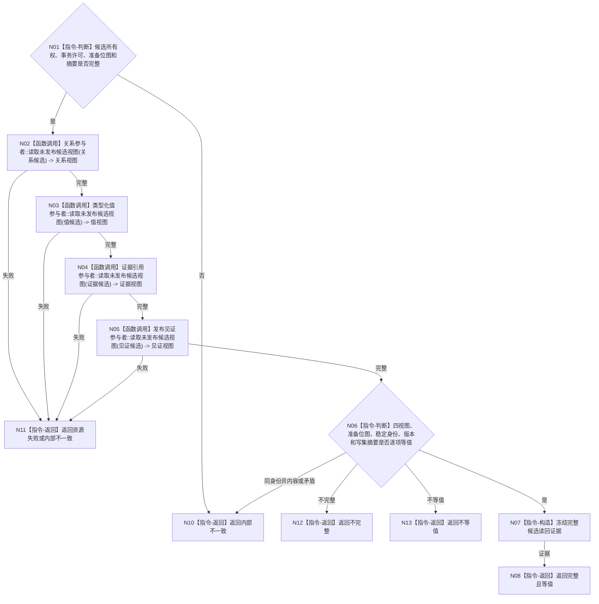

# BIZ-L4-002-06-05-03 读回全部未发布参与者候选目标函数流程图 v0.1

更新时间：2026-08-03

## 依据

```text
4010—4050、5110；BIZ-L3-002-06-05；BIZ-L4-002-06-05-02
```

## 身份与边界

正式目标函数设计图。在同一事务域许可下读回四类未发布参与者候选并与冻结写集逐项互证；不确认、不发布、不修补候选。

## 函数合同

```text
根函数：需求活动重判数据操作::读回全部未发布参与者候选
归属模块 / 文件 / 层级：需求活动重判数据操作 / 海中鱼巣/领域/数据操作.需求活动重判.ixx / L4
现有或待新增：待新增内部函数
完整签名：需求活动重判候选读回结果 需求活动重判数据操作::读回全部未发布参与者候选(const 需求活动重判事务候选& 候选) const
参数：候选为只读借用；生命周期不得超过调用；必须持有同一事务域许可、完整准备位图和冻结写集摘要
返回结果：不可变值式结果；含完整且等值、不完整、不等值、资源失败或内部不一致，以及四类候选投影、准备位图和摘要互证
被调函数流程图：四类通用参与者的候选只读视图为业务中性内部能力，不重复建立目标业务图
父图：BIZ-L3-002-06-05
```

## 流程图



## 节点合同

| 节点 | 类型 | 参数 / 输入绑定 | 结果 / 输出绑定 | 事实读写 | 后继条件 | 验证 |
| --- | --- | --- | --- | --- | --- | --- |
| N02—N05 | 函数调用 | 同一移动候选内的四参与者身份 | 四类不可变候选视图 | 只读未发布候选 | 全部读取后互证 | 普通查询仍不得看见候选 |
| N06/N07 | 指令-判断 / 构造 | 四视图、位图和冻结摘要 | 完整候选读回证据 | 无 | 等值或具名非成功 | 数量、身份、版本、角色和内容逐项一致 |
| N08/N10—N13 | 指令-返回 | 互证状态 | 结构化结果 | 无 | 返回父图 | 不等值触发撤销，不得现场修补 |

## 关键边界

本函数只证明未发布候选与请求等值，不证明事实已发布。任何遗漏、重复异内容、版本矛盾或参与者视图不一致都禁止进入确认；不得用日志、SQL、序列化摘要或计数相等替代逐项读回。

