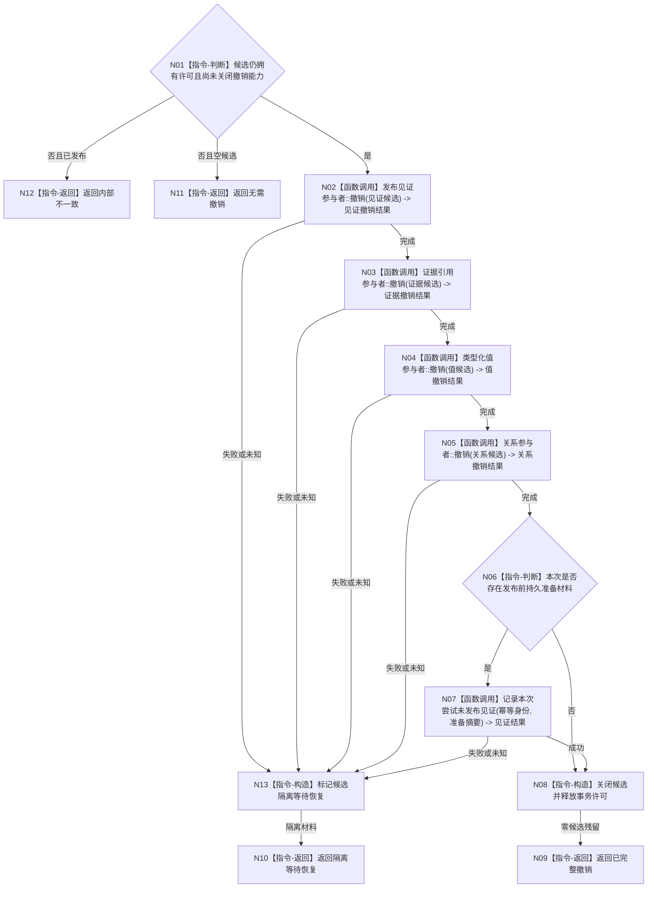

# BIZ-L4-002-06-05-04 逆序撤销需求活动重判事务目标函数流程图 v0.1

更新时间：2026-08-03

## 依据

```text
4010—4050；BIZ-L3-002-06-05；BIZ-L4-002-06-05-02/03
```

## 身份与边界

正式目标函数设计图。仅对尚未原子发布的需求活动重判候选按准备逆序撤销，必要时形成持久“本次尝试未发布”见证；发布后禁止调用本函数伪装回滚。

## 函数合同

```text
根函数：需求活动重判数据操作::逆序撤销事务
归属模块 / 文件 / 层级：需求活动重判数据操作 / 海中鱼巣/领域/数据操作.需求活动重判.ixx / L4
现有或待新增：待新增内部函数
完整签名：需求活动重判撤销结果 需求活动重判数据操作::逆序撤销事务(需求活动重判事务候选&& 候选) noexcept
参数：候选为唯一移动所有权；必须尚未发布，携带事务许可、准备位图、幂等身份和持久准备状态
返回结果：值式结果；含已完整撤销、无需撤销、隔离等待恢复或内部不一致，以及各参与者撤销见证、未发布见证状态和零已发布变化证明
被调函数流程图：四类参与者撤销和持久未发布见证记录属于4040通用内部能力，不重复建立公开图
父图：BIZ-L3-002-06-05；BIZ-L4-002-06-05-02内部失败路径复用
```

## 流程图



## 节点合同

| 节点 | 类型 | 参数 / 输入绑定 | 结果 / 输出绑定 | 事实读写 | 后继条件 | 验证 |
| --- | --- | --- | --- | --- | --- | --- |
| N01 | 指令-判断 | 移动候选状态 | 可撤销资格 | 无 | 可撤销、空或非法 | 发布后撤销必须拒绝 |
| N02—N05 | 函数调用 | 准备位图中的已准备参与者 | 逐项撤销见证 | 清除未发布候选 | 严格逆序 | 每个断点和部分准备组合 |
| N06/N07 | 指令-判断 / 函数调用 | 持久准备状态、幂等身份和摘要 | 未发布见证 | 只写非权威持久证据 | 成功后方可释放 | SQL结果不改变内存事实；未知则隔离 |
| N08/N09 | 指令-构造 / 返回 | 全部撤销和见证 | 已完整撤销 | 释放事务许可 | 返回 | 普通查询始终零变化 |
| N10—N13 | 指令-返回 / 构造 | 非成功状态 | 隔离或内部结果 | 不伪造回滚 | 停止依赖路径 | 不把撤销异常降级为普通拒绝 |

## 关键边界

只有未发布候选可撤销。撤销失败、结果未知或“未发布”持久见证失败时必须保留隔离材料交恢复协议，不能释放后按新幂等身份重做；完整撤销也只证明本次没有发布，不证明业务候选本身合法。
