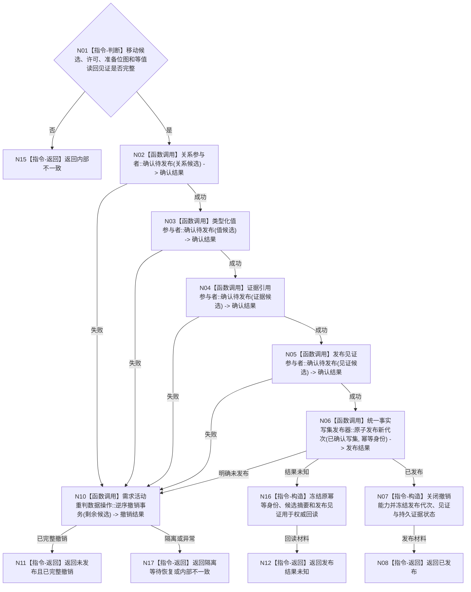

# BIZ-L4-002-06-05-05 确认并原子发布需求活动重判事务目标函数流程图 v0.1

更新时间：2026-08-03

## 依据

```text
3100、4010—4050、5110、5160；BIZ-L3-002-06-05；BIZ-L4-002-06-05-02—04
```

## 身份与边界

正式目标函数设计图。在完整候选读回成立后按登记顺序确认全部参与者，发布前失败由本函数内部逆序撤销；全部确认后只在最后发布区原子切换一个需求事实代次。

## 函数合同

```text
根函数：需求活动重判数据操作::确认并原子发布事务
归属模块 / 文件 / 层级：需求活动重判数据操作 / 海中鱼巣/领域/数据操作.需求活动重判.ixx / L4
现有或待新增：待新增内部函数；复用4040统一事实写集发布器
完整签名：需求活动重判确认发布结果 需求活动重判数据操作::确认并原子发布事务(需求活动重判事务候选&& 候选)
参数：候选为唯一移动所有权；必须持有同一事务许可、完整准备位图、等值读回见证、幂等身份和冻结语义摘要
返回结果：值式结果；含已发布、未发布且已完整撤销、发布结果未知、隔离等待恢复或内部不一致，以及发布代次、发布见证、持久证据状态和原幂等身份
被调函数流程图：BIZ-L4-002-06-05-04用于发布前失败收敛；通用参与者确认与统一事实写集最后发布器不重复建立目标业务图
父图：BIZ-L3-002-06-05
```

## 流程图



## 节点合同

| 节点 | 类型 | 参数 / 输入绑定 | 结果 / 输出绑定 | 事实读写 | 后继条件 | 验证 |
| --- | --- | --- | --- | --- | --- | --- |
| N02—N05 | 函数调用 | 四类完整候选 | 待发布确认位 | 仍不可普通读取 | 全确认或内部撤销 | 确认顺序固定；任点失败均收敛 |
| N06 | 函数调用 | 已确认写集、原幂等身份和摘要 | 已发布、明确未发布或未知 | 原子切换一个内存事实代次 | 仅已发布关闭撤销 | 唯一线性化点；SQL/锁释放不算发布 |
| N10/N11 | 函数调用 / 返回 | 尚未发布的候选 | 完整撤销或隔离 | 零已发布变化 | 完整后返回 | 复用BIZ-L4-002-06-05-04 |
| N07/N08 | 指令-构造 / 返回 | 发布代次和见证 | 已发布材料 | 新代次已可见 | 交联合读回 | 持久证据状态分账 |
| N12/N15—N17 | 指令-返回 / 构造 | 未知或异常 | 原键回读或停止材料 | 不伪造结果 | 返回 | 发布未知禁止换键或生成第二事实 |

## 关键边界

参与者“确认待发布”不是发布；只有统一写集最后切换内存代次才使活动路径、权重、当前性、父目标证据引用和需求树版本共同可见。发布成功后不得撤销，持久证据失败不得静默改写已发布事实。
