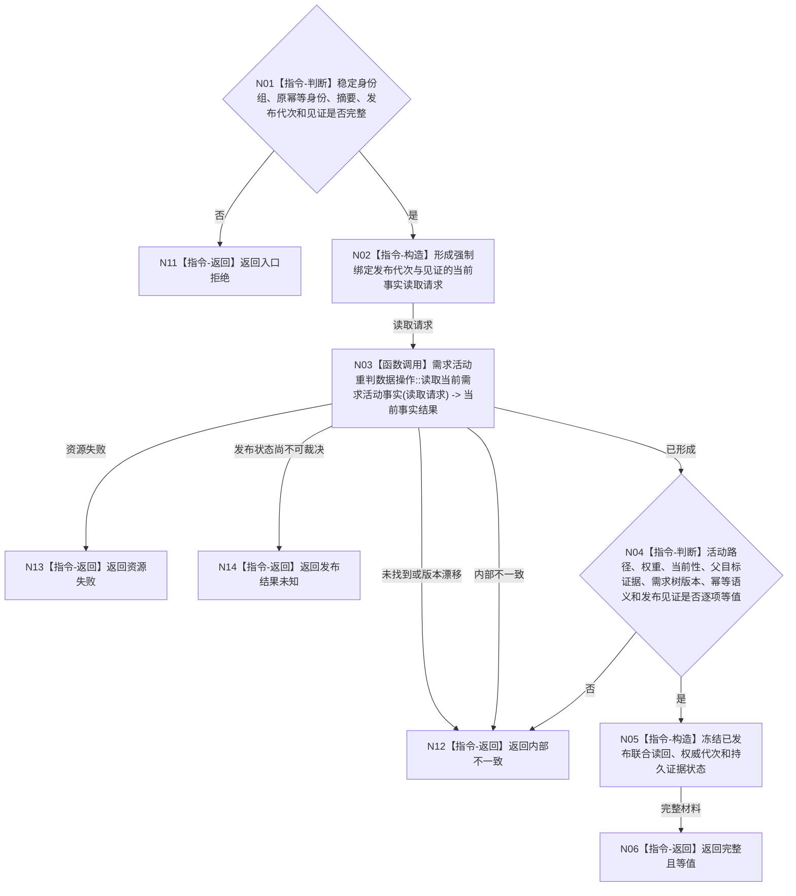

# BIZ-L4-002-06-05-06 联合读回已发布需求活动事实目标函数流程图 v0.1

更新时间：2026-08-03

## 依据

```text
3100、4010—4050、5110、5160；BIZ-L3-002-06-05；BIZ-L4-002-06-05-01/05
```

## 身份与边界

正式目标函数设计图。按原稳定身份、幂等身份、发布代次和见证，从内存权威联合读回本次需求活动重判的全部已发布事实并与冻结写集互证；不以持久证据或显示投影补判。

## 函数合同

```text
根函数：需求活动重判数据操作::联合读回已发布需求活动事实
归属模块 / 文件 / 层级：需求活动重判数据操作 / 海中鱼巣/领域/数据操作.需求活动重判.ixx / L4
现有或待新增：待新增；复用BIZ-L4-002-06-05-01的值式读取组合但强制绑定发布代次与见证
完整签名：需求活动已发布联合读回结果 需求活动重判数据操作::联合读回已发布需求活动事实(const 需求活动已发布联合读回请求& 请求) const
参数：请求为只读借用；含原稳定身份组、幂等身份、冻结写集摘要、发布代次、发布见证、需求树版本和路径规则版本
返回结果：调用方拥有的不可变值式结果；含完整且等值、未找到、版本漂移、发布结果未知、资源失败或内部不一致，以及活动路径、权重、当前性、父目标证据引用、需求树版本、发布见证和持久证据状态
被调函数流程图：复用BIZ-L4-002-06-05-01的当前事实组合读取；发布见证与代次强绑定复核为本函数内指令
父图：BIZ-L3-002-06-05
```

## 流程图



## 节点合同

| 节点 | 类型 | 参数 / 输入绑定 | 结果 / 输出绑定 | 事实读写 | 后继条件 | 验证 |
| --- | --- | --- | --- | --- | --- | --- |
| N02 | 指令-构造 | 发布代次、见证、身份组和规则版本 | 强绑定读取请求 | 无 | 请求完整 | 禁止隐式最新或跨代次拼接 |
| N03 | 函数调用 | 强绑定请求 -> 请求 | 当前事实与发布见证 | 只读内存已发布事实 | 已形成或具名非成功 | 复用BIZ-L4-002-06-05-01，不查SQL补判 |
| N04/N05 | 指令-判断 / 构造 | 当前事实、冻结摘要和发布结果 | 联合读回 | 无 | 全等值或内部不一致 | 全身份、关系、值、版本和见证逐项互证 |
| N06/N11—N14 | 指令-返回 | 读回状态 | 结构化结果 | 无 | 返回 | 发布后缺失/矛盾属于内部不一致；未知单列 |

## 关键边界

发布后联合读回是完成证明的一部分，但仍只证明需求活动重判写集进入一个内存权威代次，不证明5160正式结算或4320价值结算成立。SQL、材料文件、日志、缓存和控制面板只能保存或显示旁路证据，不能补齐缺失的内存事实。

