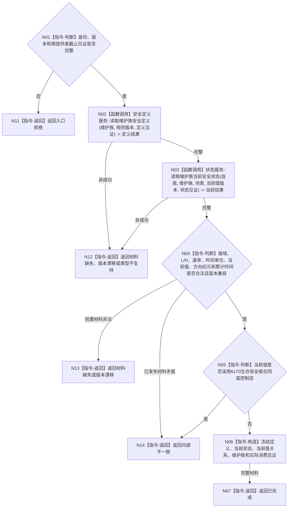

# BIZ-L4-003-01-01-01 读取安全层定义与当前值目标函数流程图 v0.1

更新时间：2026-08-03

## 依据

```text
4010—4050、6140；BIZ-L3-003-01-01
当前抽象端口：海中鱼巣/领域/服务.分层安全维护.ixx
```

## 身份与边界

正式目标函数设计图。读取一个维护族的强类型安全定义、当前值状态、方向维护纪元和累计有效时间；分层安全值与6170生存安全根严格分账。

## 函数合同

```text
根函数：分层安全维护事实提供者::读取安全层定义与当前值
归属模块 / 文件 / 层级：分层安全维护事实具体提供者 / 海中鱼巣/领域/提供者.分层安全维护事实.ixx / L4
现有或待新增：待新增具体提供者内部函数；抽象总入口当前存在
完整签名：安全定义当前读取结果 分层安全维护事实提供者::读取安全层定义与当前值(const 安全定义当前读取请求& 请求) const
参数：请求为只读借用；含自我、维护族、适用场景、期望当前值版本、维护规则版本及安全定义/状态提供者截止见证
返回结果：不可变值式结果；含已形成、材料缺失、版本漂移、类型不支持、资源失败或内部不一致，以及定义、当前状态、当前值关系、维护账和实际消费见证
被调函数流程图：安全定义与状态领域的具名只读服务；其内部仓库读取不向本领域暴露
父图：BIZ-L3-003-01-01
```

## 流程图



## 节点合同

| 节点 | 类型 | 参数 / 输入绑定 | 结果 / 输出绑定 | 事实读写 | 后继条件 | 验证 |
| --- | --- | --- | --- | --- | --- | --- |
| N02 | 函数调用 | 维护族、规则版本和定义见证 | I64值域、L/H、速率、时间单位和定义身份 | 只读定义事实 | 完整或具名非成功 | `Vmin <= L < H <= Vmax`、版本非零 |
| N03 | 函数调用 | 自我、维护族、场景、当前值版本和状态见证 | 当前值、状态、方向纪元、累计时间和当前关系 | 只读状态事实 | 完整或具名非成功 | 唯一当前、历史隔离 |
| N04/N05 | 指令-判断 | 定义和当前材料 | 合法性与强类型分账 | 无 | 合法才构造 | 分层安全不套用根值0/1/>1语义 |
| N06/N07/N11—N14 | 指令-构造 / 返回 | 读取状态 | 完整载荷或具名结果 | 无 | 返回 | 见证、身份、量纲和版本可回查 |

## 关键边界

当前值由自我实例特征槽、当前值关系和完整状态事实承载；定义参数只来自安全定义记录。不得从名称、枚举层号、SQL、缓存或默认值重建定义，也不得把生存安全根复制为分层安全当前值。
