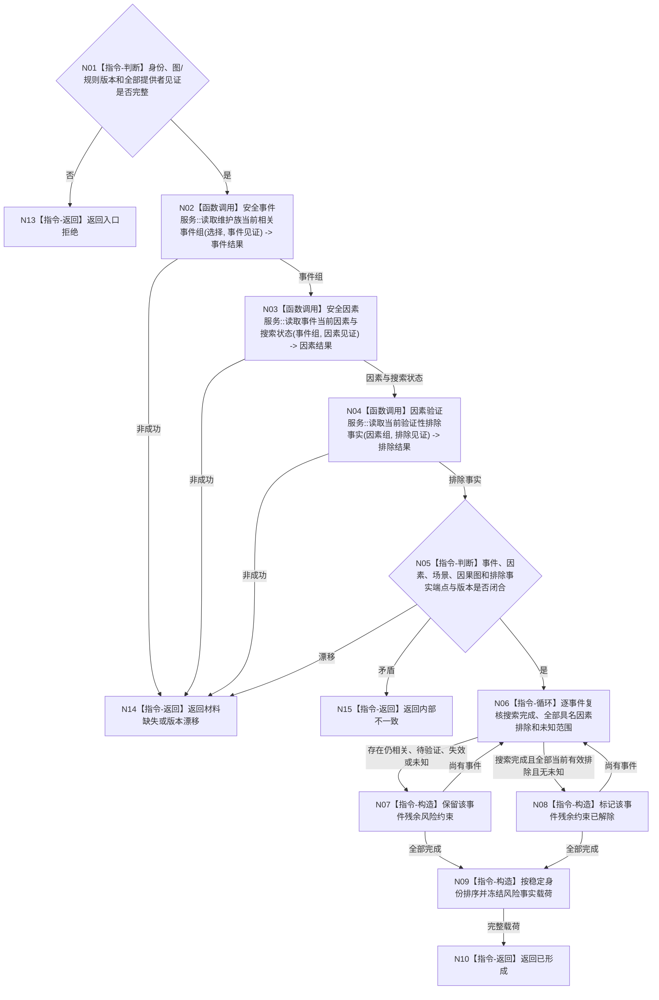

# BIZ-L4-003-01-01-02 读取事件因素与残余风险事实目标函数流程图 v0.1

更新时间：2026-08-03

## 依据

```text
3100、4010—4050、4210、4220、6140；BIZ-L3-003-01-01
```

## 身份与边界

正式目标函数设计图。读取与维护族及适用场景相关的当前安全事件、因素搜索、因素状态、验证性排除和残余约束；不把未发现、未复发或未知因素推断为已排除。

## 函数合同

```text
根函数：分层安全维护事实提供者::读取事件因素与残余风险事实
归属模块 / 文件 / 层级：分层安全维护事实具体提供者 / 海中鱼巣/领域/提供者.分层安全维护事实.ixx / L4
现有或待新增：待新增具体提供者内部函数
完整签名：安全风险事实读取结果 分层安全维护事实提供者::读取事件因素与残余风险事实(const 安全风险事实读取请求& 请求) const
参数：请求为只读借用；含自我、维护族、目标安全结果、具体安全结果、适用场景、因果图版本、规则版本及事件/因素/排除提供者截止见证
返回结果：不可变值式结果；含已形成、材料缺失、版本漂移、资源失败或内部不一致，以及稳定排序的事件、因素、排除事实、未知范围、残余约束和实际消费见证
被调函数流程图：安全事件、因果因素、场景和因素验证领域的具名只读服务；不得直达仓库或SQL
父图：BIZ-L3-003-01-01
```

## 流程图



## 节点合同

| 节点 | 类型 | 参数 / 输入绑定 | 结果 / 输出绑定 | 事实读写 | 后继条件 | 验证 |
| --- | --- | --- | --- | --- | --- | --- |
| N02—N04 | 函数调用 | 同一维护族、事件范围及各提供者见证 | 事件、因素搜索、因素状态和排除事实 | 只读具名领域事实 | 全部完整后复核 | 无事件允许空组；应有关系损坏不得当空组 |
| N05 | 指令-判断 | 三组材料和因果图/场景版本 | 端点与版本闭合 | 无 | 闭合或具名非成功 | 同因素同时仍相关与已排除为内部不一致 |
| N06—N08 | 指令-循环 / 构造 | 每事件搜索与因素证据 | 残余约束状态 | 无 | 逐事件完成 | 未发现、未复发和未知不等于排除 |
| N09/N10/N13—N15 | 指令-构造 / 返回 | 全部事件结果 | 稳定值式载荷 | 无 | 返回 | 输出稳定排序、无名称或时间戳裁决 |

## 关键边界

残余约束只决定高位被动回落是否继续成立，不证明新事件发生或安全值应立即下降。一个事件只有搜索完成、全部具名因素有当前有效排除、无未知范围且证据适用当前自我/结果/场景时才能解除约束。
