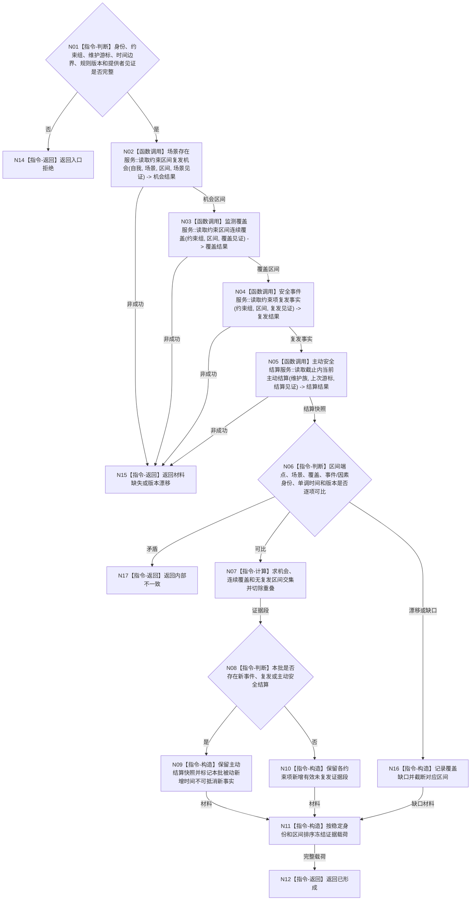

# BIZ-L4-003-01-01-03 读取未复发证据与主动结算目标函数流程图 v0.1

更新时间：2026-08-03

## 依据

```text
4010—4050、6100、6140；BIZ-L3-003-01-01；BIZ-L4-003-01-01-02
```

## 身份与边界

正式目标函数设计图。读取各残余约束项的复发机会、连续覆盖、未复发区间和本批主动安全结算，形成可供纯值算法消费的证据材料；不按物理时间或循环次数自行累计。

## 函数合同

```text
根函数：分层安全维护事实提供者::读取未复发证据与主动结算
归属模块 / 文件 / 层级：分层安全维护事实具体提供者 / 海中鱼巣/领域/提供者.分层安全维护事实.ixx / L4
现有或待新增：待新增具体提供者内部函数
完整签名：安全维护证据读取结果 分层安全维护事实提供者::读取未复发证据与主动结算(const 安全维护证据读取请求& 请求) const
参数：请求为只读借用；含自我、维护族、适用场景、残余约束身份组、上次维护游标、当前单调时间边界、维护规则版本及场景/覆盖/复发/主动结算提供者截止见证
返回结果：不可变值式结果；含已形成、材料缺失、版本漂移、资源失败或内部不一致，以及稳定排序且已去重的未复发证据段、覆盖缺口、主动结算快照组、来源版本和实际消费见证
被调函数流程图：场景存在、监测覆盖、安全复发和6100主动结算领域的具名只读服务；时间来源复用BIZ-L4-002-01-02-01的单调时间证据
父图：BIZ-L3-003-01-01
```

## 流程图



## 节点合同

| 节点 | 类型 | 参数 / 输入绑定 | 结果 / 输出绑定 | 事实读写 | 后继条件 | 验证 |
| --- | --- | --- | --- | --- | --- | --- |
| N02—N05 | 函数调用 | 固定约束组、区间和各提供者见证 | 机会、覆盖、复发和主动结算材料 | 只读已发布事实 | 全部读取后比较 | 没有消息、日志或循环次数不形成证据 |
| N06/N07 | 指令-判断 / 计算 | 四组区间与身份版本 | 有效交集、截断和去重段 | 无 | 可比才计时 | 不连续相加、重叠不重复、结束不早于开始 |
| N08—N10 | 指令-判断 / 构造 | 新事件/复发/主动结算与证据段 | 本批维护证据 | 无 | 主动事实优先 | 同批旧累计时间不得抵消新事件结果 |
| N11/N12/N14—N17 | 指令-构造 / 返回 | 证据、缺口和来源见证 | 稳定值式载荷或具名结果 | 无 | 返回 | 多约束最小新增时间由后续纯值算法计算 |

## 关键边界

物理时间经过本身不产生安全事实；只有复发机会、场景可比、连续监测覆盖、身份可比和确认未复发同时成立的交集才是有效证据。全部风险解除不由本函数判断；主动结算存在时本函数只提供快照并明确新事实优先边界。
