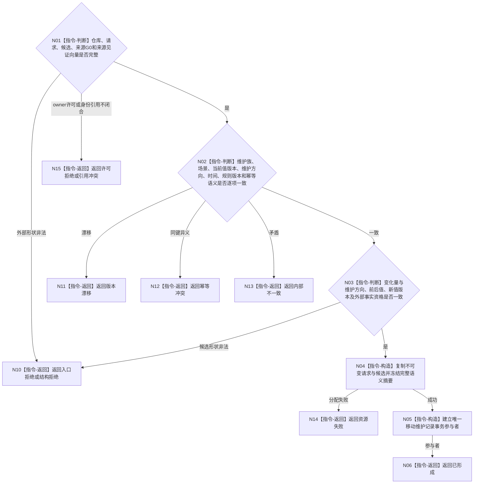

# BIZ-L4-003-01-04-01 形成分层安全维护记录参与者目标函数流程图 v0.2

更新时间：2026-08-27

## 依据

```text
4010—4050、6140；BIZ-L3-003-01-04 v0.2
当前发布源码：无 `参与者.分层安全维护记录.ixx`；目标参与者待实现
```

## 身份与边界

正式目标函数设计图。把纯值维护候选冻结为需求外的安全领域事务参与者；参与者只管理维护账、方向纪元、已消费证据窗和幂等语义，不创建特征值、状态、动态或关系。

## 函数合同

```text
根函数：形成分层安全维护记录参与者
归属模块 / 文件 / 目标分解深度：分层安全维护记录参与者 / 海中鱼巣/领域/参与者.分层安全维护记录.ixx / BIZ-L4
现有或待新增：目标函数待新增；需承接来源G0、具名来源见证向量和原幂等身份
完整签名：分层安全维护记录参与结果 形成分层安全维护记录参与者(分层安全维护记录仓库& 仓库, const 安全维护请求& 请求, const 安全维护载荷& 候选) noexcept
参数：仓库为调用期间可写借用且只由参与者封装；请求和候选为只读借用，必须同自我、维护族、场景、幂等身份、当前值版本、来源见证向量和规则版本
返回结果：移动结果；含已形成、入口拒绝、许可拒绝、结构拒绝、版本漂移、幂等冲突、引用冲突、资源失败或内部不一致；成功时唯一携带不可复制的节点直接事务参与者，其余状态无参与者
被调函数流程图：无独立业务函数；候选合法性、完整语义摘要和参与者构造为本函数内指令
父图：BIZ-L3-003-01-04 v0.2
```

## 流程图



## 节点合同

| 节点 | 类型 | 参数 / 输入绑定 | 结果 / 输出绑定 | 事实读写 | 后继条件 | 验证 |
| --- | --- | --- | --- | --- | --- | --- |
| N01—N03 | 指令-判断 | 仓库、请求、候选、来源G0、见证和全部版本 | 合法性、许可、引用、幂等和变化分支 | 无 | 全部通过才构造 | 零变化仍可推进维护账；记录参与者不裁决或持有外部事实包 |
| N04/N05 | 指令-构造 | 完整请求、候选和摘要 | 不可复制参与者 | 未发布候选 | 唯一所有权 | 不泄漏仓库、锁、确认或撤销入口 |
| N06/N10—N15 | 指令-返回 | 构造状态 | 结构化结果 | 无已发布变化 | 返回 | 许可、引用、冲突、漂移、资源和内部错误分离 |

## 关键边界

参与者形成不是发布。合法无值变化必须记录维护游标、方向纪元或累计时间的真实推进，不能只返回临时算法结果；但不得为此伪造状态、动态、关系或哨兵节点。
