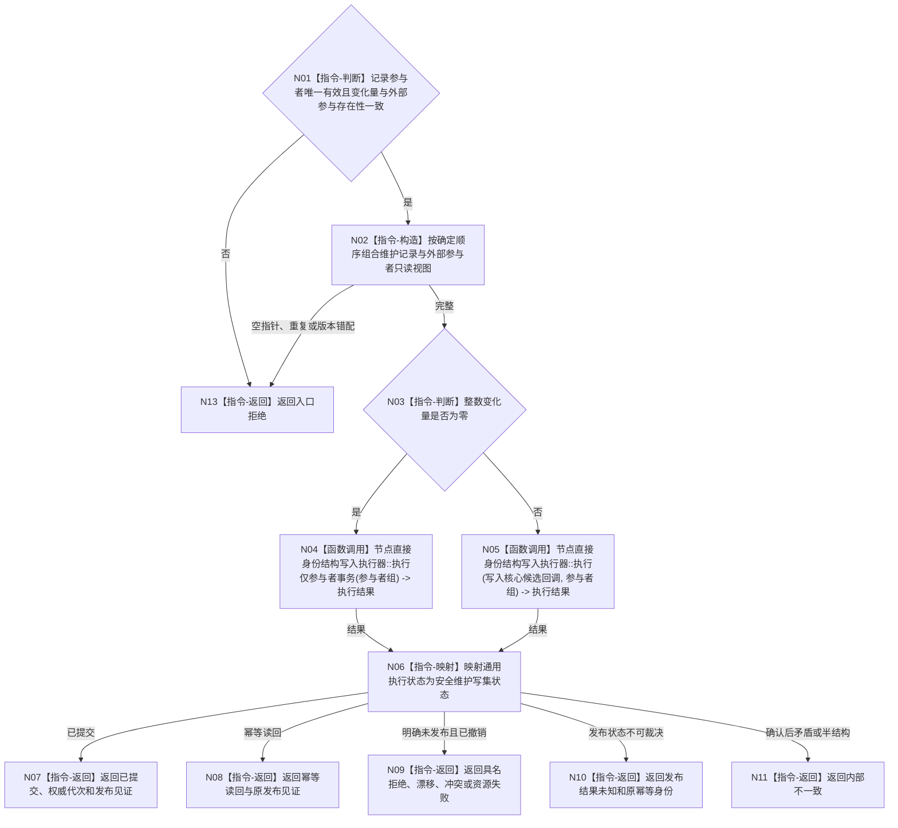

# BIZ-L4-003-01-04-02 执行安全维护写集目标函数流程图 v0.1

更新时间：2026-08-03

## 依据

```text
4010—4050、4190、6140；BIZ-L3-003-01-04；BIZ-L4-003-01-04-01
旧鱼巢可吸收：动态、实际结果和结算先形成完整事实再进入后继；排除线程或返回码自证发布
```

## 身份与边界

正式目标函数设计图。按变化量选择仅参与者事务或节点直接身份结构写入事务，但二者共享同一准备、确认、逆序撤销、最后发布和幂等结果语义。

## 函数合同

```text
根函数：分层安全数据操作::执行安全维护写集
归属模块 / 文件 / 层级：分层安全数据操作 / 海中鱼巣/领域/数据操作.分层安全.ixx / L4
现有或待新增：待从当前提交函数中提取内部函数；复用节点直接身份结构写入执行器
完整签名：安全维护写集执行结果 分层安全数据操作::执行安全维护写集(const 安全维护请求& 请求, const 安全维护载荷& 候选, 分层安全维护记录参与结果&& 记录参与者, std::optional<安全维护外部事实参与载荷>&& 外部参与) noexcept
参数：请求和候选为只读借用；记录参与者和可选外部参与均为唯一移动所有权；零变化禁止外部参与，非零变化要求完整外部参与
返回结果：值式结果；含已提交、幂等读回、入口拒绝、许可拒绝、幂等冲突、版本漂移、资源失败、候选已撤销、发布结果未知或内部不一致，以及权威代次、发布见证和持久证据状态
被调函数流程图：节点直接身份结构写入执行器::执行仅参与者事务 / 执行为通用现有能力；外部参与包内部写核心候选，不向本函数泄漏参与者控制权
父图：BIZ-L3-003-01-04
```

## 流程图



## 节点合同

| 节点 | 类型 | 参数 / 输入绑定 | 结果 / 输出绑定 | 事实读写 | 后继条件 | 验证 |
| --- | --- | --- | --- | --- | --- | --- |
| N01/N02 | 指令-判断 / 构造 | 两类移动所有权、候选代次和来源见证 | 稳定参与者序列 | 无 | 完整才执行 | 无空、无重复、不泄漏可变参与者 |
| N04 | 函数调用 | 维护记录参与者组 | 通用事务结果 | 仅安全领域记录 | 执行完成 | 无值变化不构造核心哨兵 |
| N05 | 函数调用 | 外部核心候选回调和完整参与者组 | 通用事务结果 | 特征值、状态、动态、关系、索引和维护账同事务 | 执行完成 | 全准备、确认、逆序撤销、最后发布 |
| N06—N11/N13 | 指令-映射 / 返回 | 通用结果和发布见证 | 安全写集结果 | 无额外写入 | 返回父图 | 发布未知、资源失败和内部不一致不得混同 |

## 关键边界

线程、回调返回、锁释放、SQL或持久材料成功均不是发布点。变化和无变化两条路线都必须使用统一事实事务；发布前失败可逆序撤销，发布后不得用撤销伪装回滚，未知结果只按原幂等身份收敛。

