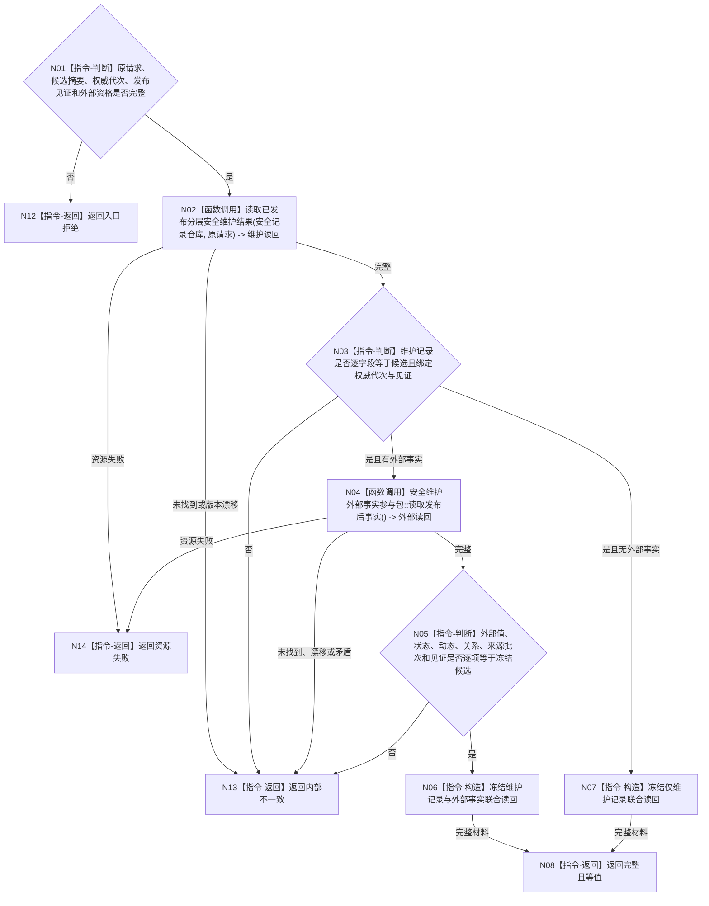

# BIZ-L4-003-01-04-03 联合读回已发布安全维护写集目标函数流程图 v0.1

更新时间：2026-08-03

## 依据

```text
4010—4050、4190、4220、6140；BIZ-L3-003-01-04；BIZ-L4-003-01-04-02
```

## 身份与边界

正式目标函数设计图。绑定原请求、候选、权威代次和发布见证，读回维护记录及可选外部事实并逐项互证；读回只证明本次写集，不升级为需求满足、任务完成或风险解除。

## 函数合同

```text
根函数：分层安全数据操作::联合读回已发布安全维护写集
归属模块 / 文件 / 层级：分层安全数据操作 / 海中鱼巣/领域/数据操作.分层安全.ixx / L4
现有或待新增：待从当前提交函数中提取内部函数；复用现有维护记录和外部参与包读回
完整签名：安全维护联合读回结果 分层安全数据操作::联合读回已发布安全维护写集(const 安全维护联合读回请求& 请求) const noexcept
参数：请求为只读借用；含原安全维护请求、冻结候选摘要、原幂等身份、权威代次、发布见证、持久证据状态和可选外部事实只读端口
返回结果：不可变值式结果；含完整且等值、未找到、版本漂移、发布结果未知、资源失败或内部不一致，以及维护记录、可选外部事实、来源见证向量和权威发布材料
被调函数流程图：现有 `读取已发布分层安全维护结果` 与外部参与包 `读取发布后事实` 为直接只读能力；其内部仓库读取不重复展开
父图：BIZ-L3-003-01-04
```

## 流程图



## 节点合同

| 节点 | 类型 | 参数 / 输入绑定 | 结果 / 输出绑定 | 事实读写 | 后继条件 | 验证 |
| --- | --- | --- | --- | --- | --- | --- |
| N02 | 函数调用 | 原幂等身份和安全请求 | 已发布维护记录 | 只读安全记录权威 | 完整后互证 | 无变化也必须有维护账记录 |
| N03 | 指令-判断 | 维护记录、候选摘要、代次和见证 | 维护记录等值性 | 无 | 有外部资格才继续外部读回 | 全字段而非计数或摘要单独证明 |
| N04/N05 | 函数调用 / 指令-判断 | 外部只读端口与冻结候选 | 特征值、状态、动态、关系和来源材料 | 只读同代次已发布事实 | 全部等值 | 缺失不能由SQL、日志或缓存补齐 |
| N06—N08/N12—N14 | 指令-构造 / 返回 | 两组读回状态 | 联合读回或具名非成功 | 无 | 返回 | 发布后矛盾停止依赖路径 |

## 关键边界

旧鱼巢“结果结构写后必须读回再结算”的节奏在此保留；旧模板、线程回执或显示摘要不迁移。读回完整也只证明安全维护写集成立，不证明因素已排除、需求已满足或服务价值已结算。
