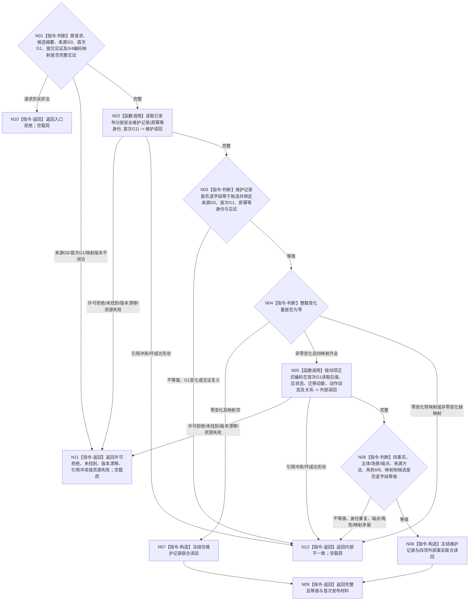

# BIZ-L4-003-01-04-03 联合读回已发布安全维护写集目标函数流程图 v0.2

更新时间：2026-08-27

## 依据

```text
4010—4050、4190、4220、6140；BIZ-L3-003-01-04 v0.2；BIZ-L4-003-01-04-02 v0.2
确认稿51：安全被动维护双动态同写集发布
```

## 身份与边界

正式目标函数设计图。绑定原请求、来源事实截止G0、首次发布G1、候选摘要、提交见证和可选四项正式编码映射，独立读回维护记录及非零变化的四项外部事实并逐字段互证；读回只证明本次安全维护写集，不升级为需求满足、任务完成或风险解除。

## 函数合同

```text
根函数：分层安全数据操作::联合读回已发布安全维护写集
归属模块 / 文件 / 目标分解深度：分层安全数据操作 / 海中鱼巣/领域/数据操作.分层安全.ixx / BIZ-L4
现有或待新增：目标函数待新增；按L1发布映射调用正式结构读取能力，不保留已移动外部参与包的私有读端口
完整签名：安全维护联合读回结果 分层安全数据操作::联合读回已发布安全维护写集(const 安全维护联合读回请求& 请求) const noexcept
参数：请求为只读借用；含原安全维护请求、冻结候选摘要、原幂等身份、来源G0、首次G1、提交见证、持久证据状态和可选四项正式编码映射；零变化映射必须空，非零变化必须四项齐全互异
返回结果：不可变值式结果；含完整且等值、入口拒绝、许可拒绝、未找到、版本漂移、引用冲突、资源失败或内部不一致。只有完整且等值携带维护记录、可选四项外部事实、关系、来源见证和首次发布材料
被调函数流程图：正式安全维护记录读取、特征值/状态/动态/关系读取为现有ARCH-L2/DATA-L2边界能力；其内部仓库读取不重复展开
父图：BIZ-L3-003-01-04 v0.2
```

## 流程图



## 节点合同

| 节点 | 类型 | 输入绑定 | 输出绑定 | 事实读写 | 后继条件 | 验证 |
| --- | --- | --- | --- | --- | --- | --- |
| N01 | 指令-判断 | 原请求、候选、G0、G1、见证和映射 | 入口与版本裁决 | 无 | 0/4映射形状闭合才读 | G0不要求等于G1 |
| N02—N03 | 函数调用 / 判断 | 原幂等身份和首次G1 | 已发布维护记录及等值性 | 只读安全记录权威 | 完整后互证 | 无变化也必须有维护账记录 |
| N04—N06 | 判断 / 函数调用 | 变化量与可选四映射 | 后值、后状态、两个动态和关系 | 只读首次G1已发布事实 | 全部等值 | 两动态互异且端点同源；动作动态角色6绑定提交方法、角色8恰一指向迁移动能；迁移动能角色6/8为0 |
| N07—N12 | 构造 / 返回 | 两组读回状态 | 联合读回或具名非成功 | 无 | 返回 | 发布后坏成功形状或矛盾停止依赖路径 |

## 关键边界

- 已移动并被执行器消费的外部参与包不成为发布后第二读取owner；正式读回只按首次G1和L1回显的四项正式编码调用权威结构服务。
- 未找到或资源失败不证明未发布。父函数已经持有提交见证时必须收束为已可能发布并按原幂等身份重试；不得换键或重建四事实。
- 完整读回只证明安全维护写集成立，不证明因素已排除、需求已满足或服务价值已结算。
