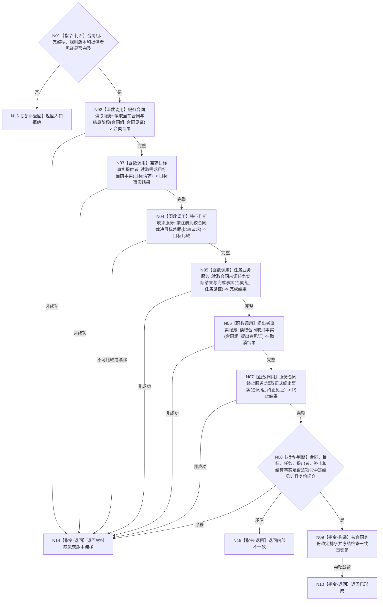

# BIZ-L4-003-02-01-01 读取合同终态一致事实目标函数流程图 v0.1

更新时间：2026-08-03

## 依据

```text
3100、4010—4050、5100、5160、6160、6170；BIZ-L3-003-02-01；BIZ-L3-004-01-01/02
旧鱼巢可吸收：任务实际结果形成后再进入需求与服务结算；排除回执直接支付
```

## 身份与边界

正式目标函数设计图。按冻结见证读取合同、需求目标当前事实、正式完成依据、提出者取消、正式终止、有效期和既有结算阶段；不裁决终态、不支付余款。

## 函数合同

```text
根函数：服务合同服务::读取合同终态一致事实
归属模块 / 文件 / 层级：服务合同治理 / 海中鱼巣/领域/服务.服务合同.ixx / L4
现有或待新增：待新增组合读取；复用需求目标当前事实与注册比较合同
完整签名：服务合同终态一致事实结果 服务合同服务::读取合同终态一致事实(const 服务合同终态一致事实请求& 请求) const
参数：请求为只读借用；含合同身份组、当前完整秒边界、合同/目标/结算规则版本及合同、需求、任务、提出者、终止和服务值提供者截止见证
返回结果：不可变值式结果；含已形成、材料缺失、版本漂移、资源失败或内部不一致，以及各合同目标比较、完成/取消/终止事实、有效期、结算阶段和实际消费见证向量
被调函数流程图：复用BIZ-L3-004-01-01读取目标当前事实、BIZ-L3-004-01-02执行注册比较；其它领域经具名只读服务
父图：BIZ-L3-003-02-01
```

## 流程图



## 节点合同

| 节点 | 类型 | 参数 / 输入绑定 | 结果 / 输出绑定 | 事实读写 | 后继条件 | 验证 |
| --- | --- | --- | --- | --- | --- | --- |
| N02 | 函数调用 | 合同身份和见证 | 当前合同、有效期、预支/余款阶段 | 只读合同事实 | 完整才读取目标 | 同有效需求至多一当前合同 |
| N03/N04 | 函数调用 | 合同目标与固定截止 | 当前目标事实和注册比较 | 只读需求/世界事实 | 具名满足状态 | 任务完成不替代目标当前满足 |
| N05—N07 | 函数调用 | 合同来源与各见证 | 完成、取消、终止正式事实 | 只读具名领域事实 | 全部读取后互证 | 回执、消息、日志和显示不成立 |
| N08—N10/N13—N15 | 指令-判断 / 构造 / 返回 | 全部材料与见证向量 | 一致事实载荷或具名非成功 | 无 | 返回父图 | 不拼接隐式最新，不按容器顺序 |

## 关键边界

完整完成必须同时有合法来源任务实际结果、独立目标当前满足和合同当前性；其中任一单独成立都不能支付余款。历史满足、普通回执、SQL和控制面板不得补齐终态事实。
