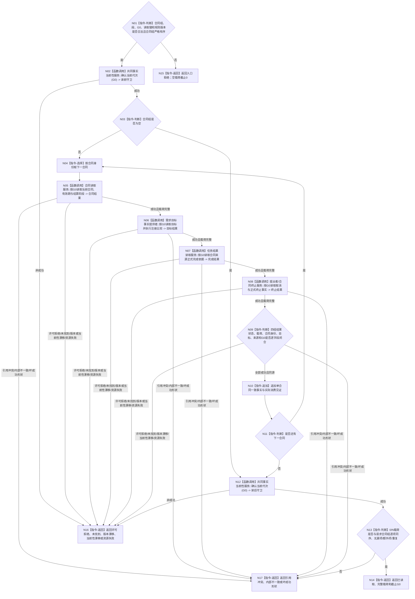

# BIZ-L4-003-02-01-01 读取合同终态一致事实目标函数流程图 v0.2

更新时间：2026-08-27

## 依据

```text
0050、4010—4050、5100、5160、6160、6170
父图：BIZ-L3-003-02-01 v0.2
```

## 身份与边界

正式目标函数设计图。函数在请求 `G0` 上读取合同、需求目标当前事实、正式完成依据、提出者取消、正式终止、有效期和既有结算阶段，并用读前/读后当前性守卫形成一份同截止不可变载荷；不裁决终态、不支付余款，不以任务回执、SQL、缓存或日志补造事实。

## 函数合同

```text
根函数：服务合同服务::读取合同终态一致事实
归属模块 / 文件 / 目标分解深度：服务合同治理 / 海中鱼巣/领域/服务.服务合同.ixx / BIZ-L4
现有或待新增：待新增组合读取；发布源码无该provider
完整签名：服务合同终态一致事实结果 服务合同服务::读取合同终态一致事实(const 服务合同终态一致事实请求& 请求) const noexcept
参数：请求为只读借用；含0/N严格有序合同身份、当前完整秒段、来源事实截止G0、合同/目标/结算规则版本和各正式读取键
返回结果：已读取时携带与请求合同组逐项同序的0/N完整一致事实、实际消费见证组和截止G0；其它状态空载荷、截止0
被调函数流程图：需求目标、注册比较、任务实际结果、提出者取消、合同终止和结算阶段的具名正式只读入口
```

## 流程图



## 节点合同

| 节点 | 类型 | 输入绑定 | 输出绑定 | 事实读写 | 后继条件 | 验证 |
| --- | --- | --- | --- | --- | --- | --- |
| N01—N03 | 判断 / 调用 | 请求、G0和合同组 | 合法入口与读前守卫 | 只读 | 0项也须经过双守卫 | 坏G0、乱序/重复、0项 |
| N04—N10 | 循环 / 调用 / 判断 | 单合同正式读取键 | 同G0一致事实 | 只读唯一owner | 全部结果状态×载荷闭合 | 回执不替代目标满足；历史不冒充当前 |
| N11—N14 | 判断 / 调用 / 返回 | 0/N聚合载荷 | 完整结果与截止G0 | 无 | 读后守卫、无漏/多/重 | N项顺序、读中代次漂移 |
| N15—N17 | 返回 | 具名非成功 | 空载荷、截止0 | 无 | 返回父图 | 普通失败与内部不一致分账 |

## 关键边界

- 完整完成必须同时具备合同当前性、合法来源任务实际结果和独立目标当前满足；任何单项都不能取得余款资格。
- 索引只定位候选，成功必须回读全部正式事实；`G0` 读前/读后不一致返回当前性漂移。
- 0合同是完整空集合成功，不等于未执行读取；成功截止必须精确为请求 `G0`。
