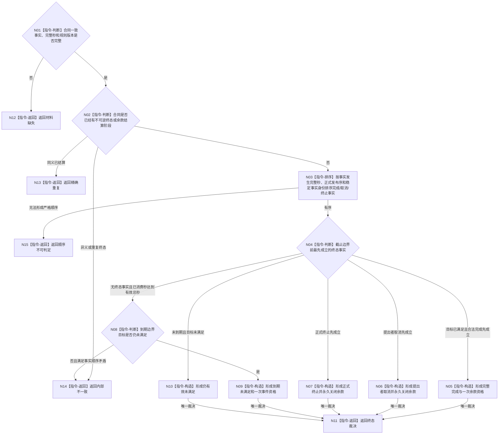

# BIZ-L4-003-02-01-02 裁决服务合同同秒唯一终态目标函数流程图 v0.1

更新时间：2026-08-03

## 依据

```text
5160、6160、6170；BIZ-L3-003-02-01；BIZ-L4-003-02-01-01
```

## 身份与边界

正式目标函数设计图。纯值裁决一个合同在当前完整秒的唯一终态，使用事实发生完整秒和正式发布序，不使用消息到达、容器遍历或日志时间。

## 函数合同

```text
根函数：裁决服务合同同秒唯一终态
归属模块 / 文件 / 层级：服务合同终态算法 / 海中鱼巣/领域/算法.服务合同终态.ixx / L4
现有或待新增：待新增纯值函数
完整签名：服务合同终态裁决结果 裁决服务合同同秒唯一终态(const 服务合同终态裁决请求& 请求) noexcept
参数：请求为只读借用；含单合同一致事实、当前完整秒、合同/目标/结算规则版本和确定性排序规则版本
返回结果：值式结果；含完整完成、提出者取消、正式终止、到期未满足、仍有效未满足、精确重复、材料缺失、顺序不可判定或内部不一致，以及唯一终态证据和余款资格
被调函数流程图：无；排序、边界比较和唯一分支均为本函数内指令
父图：BIZ-L3-003-02-01
```

## 流程图



## 节点合同

| 节点 | 类型 | 参数 / 输入绑定 | 结果 / 输出绑定 | 事实读写 | 后继条件 | 验证 |
| --- | --- | --- | --- | --- | --- | --- |
| N02 | 指令-判断 | 既有状态和结算阶段 | 重复/冲突判定 | 无 | 未结算才继续 | P1至多一次，终态不可恢复 |
| N03/N04 | 指令-排序 / 判断 | 完成、取消、终止事实 | 严格唯一先后 | 无 | 可判定才裁决 | 同秒发布序，不用消息/容器顺序 |
| N08 | 指令-判断 | 有效秒边界和目标比较 | 到期未满足资格 | 无 | 目标仍未满足才建事件 | 事件只一次，不恢复合同 |
| N05—N15 | 指令-构造 / 返回 | 唯一分支 | 终态结果 | 无 | 返回父图 | 余款资格与合同终态绑定 |

## 关键边界

完成事实只有在截止边界前已发布且目标当前满足时才取得余款资格。取消、终止或到期不追回30%预支；顺序无法证明时拒绝，不得猜测最有利分支。
