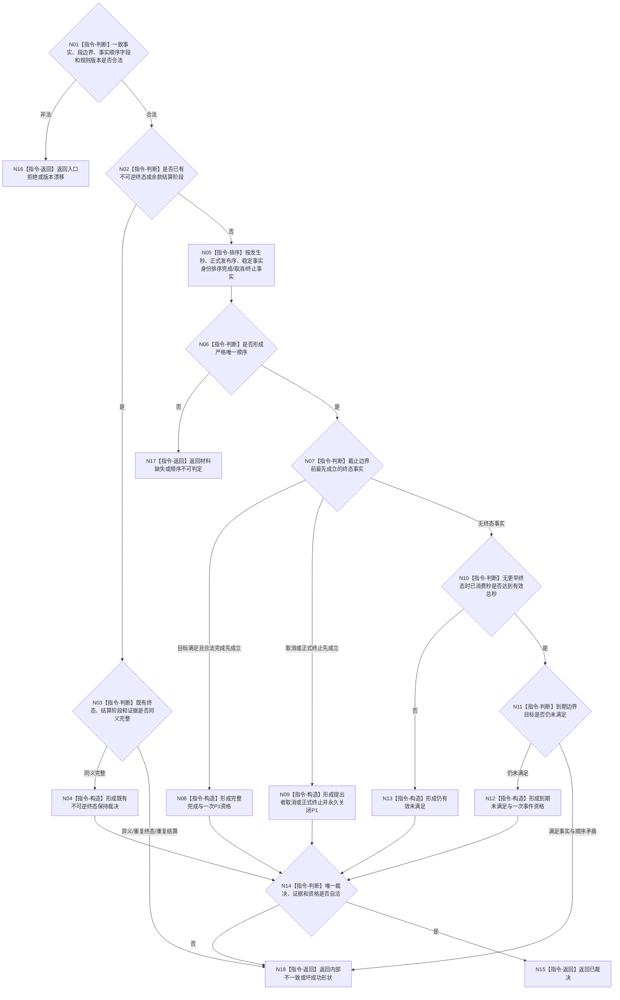

# BIZ-L4-003-02-01-02 裁决服务合同同秒唯一终态目标函数流程图 v0.2

更新时间：2026-08-27

## 依据

```text
4050、5160、6160、6170
父图：BIZ-L3-003-02-01 v0.2
```

## 身份与边界

正式目标函数设计图。纯值函数只裁决单合同在当前完整秒的唯一终态，依据事实发生完整秒、正式发布序和稳定事实身份；不读取仓库、不支付余款、不写终态。相同输入只产生相同值式输出，不取得权威“精确重复”状态。

## 函数合同

```text
根函数：裁决服务合同同秒唯一终态
归属模块 / 文件 / 目标分解深度：服务合同终态算法 / 海中鱼巣/领域/算法.服务合同终态.ixx / BIZ-L4
现有或待新增：待新增纯值函数；发布源码无该算法
完整签名：服务合同终态裁决结果 裁决服务合同同秒唯一终态(const 服务合同终态裁决请求& 请求) noexcept
参数：请求为只读借用；含单合同完整一致事实、当前段边界、合同/目标/结算/排序规则版本
返回结果：已裁决时唯一携带完整完成、提出者取消、正式终止、到期未满足、仍有效未满足或既有不可逆终态保持，以及唯一证据和余款/事件资格；其它状态空载荷
被调函数流程图：无
```

## 流程图



## 节点合同

| 节点 | 类型 | 输入绑定 | 输出绑定 | 事实读写 | 后继条件 | 验证 |
| --- | --- | --- | --- | --- | --- | --- |
| N01—N04 | 判断 / 构造 | 当前合同和既有阶段 | 既有终态保持或具名非成功 | 无 | 终态不可逆、P1至多一次 | 既有同义/异义/重复阶段 |
| N05—N09 | 排序 / 判断 / 构造 | 完成、取消、终止事实 | 严格唯一先后 | 无 | 不使用消息、容器或日志顺序 | 同秒发布序与稳定身份 |
| N10—N13 | 判断 / 构造 | 有效秒与目标比较 | 到期或仍有效 | 无 | 到期且未满足才建事件 | T-1/T、完成与到期同秒 |
| N14—N18 | 判断 / 返回 | 唯一裁决材料 | 完整载荷或空载荷非成功 | 无 | 自洽才成功 | 纯值结果不称权威精确重复 |

## 关键边界

- 完成事实只有在截止边界前已发布且目标当前满足时才取得P1资格；取消、终止或到期不追回P0。
- 顺序不能证明时返回材料缺失/顺序不可判定，不猜测最有利分支。
- 既有不可逆终态保持是正式事实的值式投影，不是本纯值函数发布或读回的“精确重复”。
