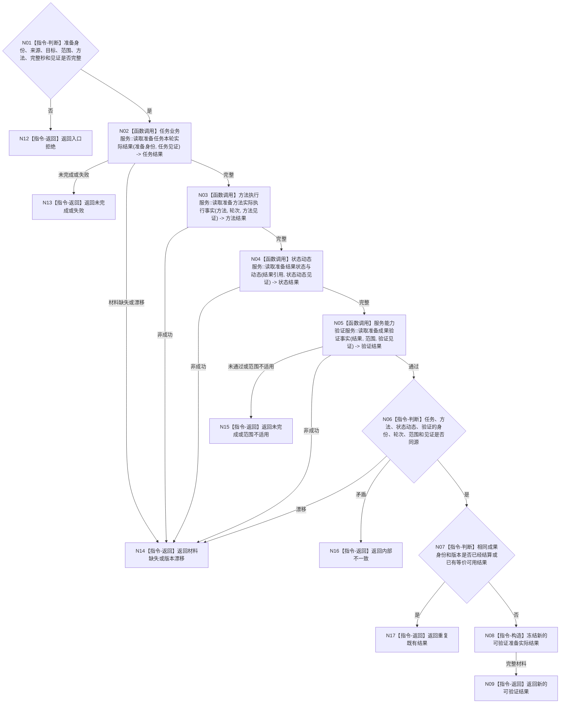

# BIZ-L4-003-02-02-01 读取准备完成实际结果目标函数流程图 v0.1

更新时间：2026-08-03

## 依据

```text
4010—4050、5120、5200、6160、6170；BIZ-L3-003-02-02
旧鱼巢可吸收：执行结果必须独立回读后才进入结算；排除工作回执自证
```

## 身份与边界

正式目标函数设计图。读取服务准备任务、方法实际结果、状态/动态和验证事实，裁决是否形成新的、可验证且在服务范围内可用的准备成果；不读取衰减段、不计算补回。

## 函数合同

```text
根函数：服务准备结算服务::读取准备完成实际结果
归属模块 / 文件 / 层级：服务准备结算 / 海中鱼巣/领域/服务.服务准备结算.ixx / L4
现有或待新增：待新增组合读取
完整签名：服务准备实际结果读取结果 服务准备结算服务::读取准备完成实际结果(const 服务准备实际结果读取请求& 请求) const
参数：请求为只读借用；含准备身份、来源需求/能力缺口、目标、服务范围、执行方法、当前完整秒、结果规则版本及任务/方法/状态/动态/验证提供者截止见证
返回结果：不可变值式结果；含新的可验证结果、未完成、失败、重复既有结果、范围不适用、材料缺失、版本漂移或内部不一致，以及结果身份、版本、验证和实际消费见证
被调函数流程图：任务实际结果、方法执行、状态动态和验证领域的具名只读服务；不直接读取队列、回执或仓库
父图：BIZ-L3-003-02-02
```

## 流程图



## 节点合同

| 节点 | 类型 | 参数 / 输入绑定 | 结果 / 输出绑定 | 事实读写 | 后继条件 | 验证 |
| --- | --- | --- | --- | --- | --- | --- |
| N02—N05 | 函数调用 | 准备、方法、轮次、结果和各见证 | 任务实际结果、方法执行、状态动态和验证 | 只读具名领域事实 | 全部完整后互证 | 工作回执、线程运行和日志不自证成果 |
| N06 | 指令-判断 | 四组材料 | 同源与当前性 | 无 | 同源才查重 | 目标、范围、方法和结果版本闭合 |
| N07/N08 | 指令-判断 / 构造 | 结果身份、版本和既有结算 | 新成果或重复 | 无 | 新成果才返回 | 重复副本不取得补回 |
| N09/N12—N17 | 指令-返回 | 读取与裁决状态 | 结构化结果 | 无 | 返回父图 | 未完成、失败、重复、范围、缺失和内部不一致分离 |

## 关键边界

服务准备只承认已经发布、可回读、可验证且适用于具名服务范围的新结果。改变显示、产生中间材料、任务回执成功或方法返回码均不足以成立准备完成。
