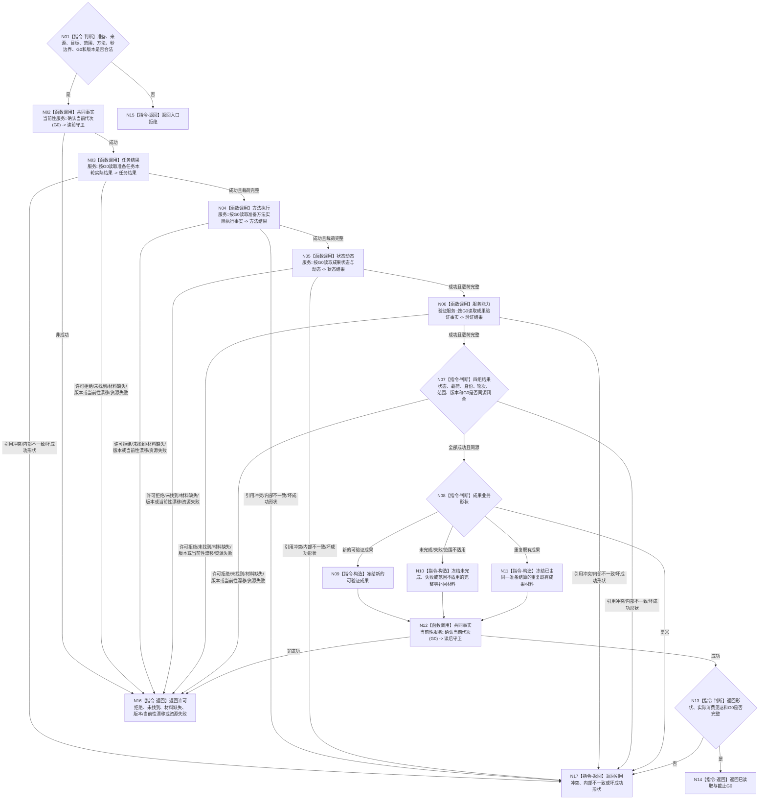

# BIZ-L4-003-02-02-01 读取准备完成实际结果目标函数流程图 v0.2

更新时间：2026-08-27

## 依据

```text
0050、4010—4050、5120、5200、6160、6170
父图：BIZ-L3-003-02-02 v0.2
```

## 身份与边界

正式目标函数设计图。函数在 `G0` 上独立读取服务准备任务、方法实际结果、状态/动态和验证事实，裁决是否存在新的、可验证且适用于具名服务范围的准备成果；不读取衰减段、不计算补回，不以工作回执、线程状态或显示结果自证完成。

## 函数合同

```text
根函数：服务准备结算服务::读取准备完成实际结果
归属模块 / 文件 / 目标分解深度：服务准备结算 / 海中鱼巣/领域/服务.服务准备结算.ixx / BIZ-L4
现有或待新增：待新增组合读取；HEAD无该provider
完整签名：服务准备实际结果读取结果 服务准备结算服务::读取准备完成实际结果(const 服务准备实际结果读取请求& 请求) const noexcept
参数：请求为只读借用；含准备身份、来源需求/能力缺口、目标、服务范围、执行方法、当前完整秒、G0和结果规则版本
返回结果：已读取时唯一携带新的可验证成果、未完成、失败、重复既有成果或范围不适用及其完整材料，截止G0；其它状态空载荷、截止0
被调函数流程图：任务实际结果、方法执行、状态动态和服务能力验证的具名正式只读入口
```

## 流程图



## 节点合同

| 节点 | 类型 | 输入绑定 | 输出绑定 | 事实读写 | 后继条件 | 验证 |
| --- | --- | --- | --- | --- | --- | --- |
| N01/N02 | 判断 / 调用 | 强类型请求和G0 | 合法入口与读前守卫 | 只读 | 当前性成立才读取 | 坏身份/范围/版本/G0 |
| N03—N07 | 调用 / 判断 | 准备、方法、轮次、结果和G0 | 四组同源正式事实 | 只读唯一owner | 状态×载荷逐项闭合 | 回执、返回码、显示不自证成果 |
| N08—N11 | 判断 / 构造 | 同源材料 | 唯一业务形状 | 无 | 新成果、普通零补回或重复既有成果 | 同结果身份异版本、范围冲突 |
| N12—N17 | 调用 / 判断 / 返回 | 冻结载荷和G0 | 已读取或空载荷非成功 | 无 | 读后守卫与见证完整 | 读中漂移、坏成功形状 |

## 关键边界

- “重复既有成果”只说明正式成果已经由同一准备结算，不是本读取函数拥有的幂等发布状态。
- 服务准备只承认已发布、可回读、可验证且适用于具名服务范围的成果；中间材料和方法返回码均不足。
- 成功必须绑定请求 `G0`；任一正式来源读中漂移都使整个组合读取失败。
