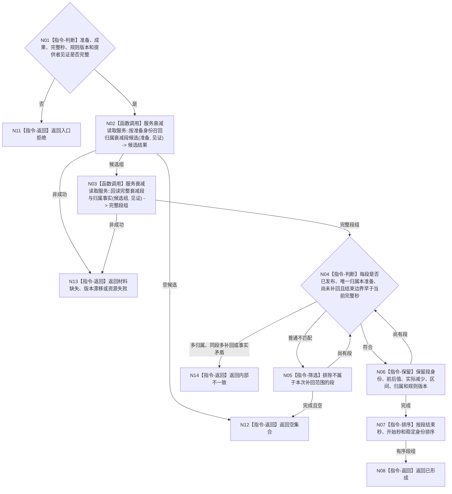

# BIZ-L4-003-02-02-02 读取唯一归属未补回衰减段目标函数流程图 v0.1

更新时间：2026-08-03

## 依据

```text
4010—4050、6160、6170；BIZ-L3-003-02-02；BIZ-L4-003-02-02-01
```

## 身份与边界

正式目标函数设计图。读取已发布、唯一归属指定准备成果、尚未补回且发生在当前完整秒之前的服务衰减段；不改配失败准备的段，不计算补回值。

## 函数合同

```text
根函数：服务准备结算服务::读取唯一归属未补回衰减段
归属模块 / 文件 / 层级：服务准备结算 / 海中鱼巣/领域/服务.服务准备结算.ixx / L4
现有或待新增：待新增只读入口
完整签名：服务准备衰减归属读取结果 服务准备结算服务::读取唯一归属未补回衰减段(const 服务准备衰减归属读取请求& 请求) const
参数：请求为只读借用；含准备身份、成果身份/版本、当前完整秒边界、衰减/归属/补回规则版本及服务衰减提供者截止见证
返回结果：不可变值式结果；含已形成、空集合、材料缺失、版本漂移、资源失败或内部不一致，以及稳定排序的衰减段、唯一归属关系、补回阶段和实际消费见证
被调函数流程图：服务衰减与准备归属领域的具名只读服务；索引命中后必须回读完整已发布事实
父图：BIZ-L3-003-02-02
```

## 流程图



## 节点合同

| 节点 | 类型 | 参数 / 输入绑定 | 结果 / 输出绑定 | 事实读写 | 后继条件 | 验证 |
| --- | --- | --- | --- | --- | --- | --- |
| N02/N03 | 函数调用 | 准备身份和固定见证 | 候选召回及完整段/归属事实 | 只读服务衰减事实 | 回读后筛选 | 索引不作权威；历史/当前分离 |
| N04—N06 | 指令-判断 / 筛选 / 保留 | 每段完整事实 | 可补回段组 | 无 | 逐段完成 | 本秒新段排除；失败准备的段不改配 |
| N07/N08/N11—N14 | 指令-排序 / 返回 | 筛选结果 | 稳定有序组或具名非成功 | 无 | 返回父图 | 同段多归属/多补回为内部不一致 |

## 关键边界

归属在衰减发生时即按准备开始秒和稳定身份冻结，后续完成顺序不得改配。本秒新衰减尚未成为此前已发生段，不能由同秒刚完成准备提前补回。
