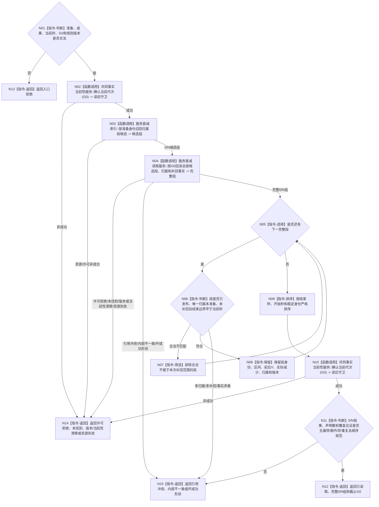

# BIZ-L4-003-02-02-02 读取唯一归属未补回衰减段目标函数流程图 v0.2

更新时间：2026-08-27

## 依据

```text
0050、4010—4050、6160、6170
父图：BIZ-L3-003-02-02 v0.2
```

## 身份与边界

正式目标函数设计图。函数在 `G0` 上完整读取已发布、唯一归属指定准备成果、尚未补回且结束边界早于当前完整秒的服务衰减段。索引只召回候选；成功必须回读0/N完整正式事实并证明无漏项、额外项或重复。

## 函数合同

```text
根函数：服务准备结算服务::读取唯一归属未补回衰减段
归属模块 / 文件 / 目标分解深度：服务准备结算 / 海中鱼巣/领域/服务.服务准备结算.ixx / BIZ-L4
现有或待新增：待新增只读入口；HEAD无该provider
完整签名：服务准备衰减归属读取结果 服务准备结算服务::读取唯一归属未补回衰减段(const 服务准备衰减归属读取请求& 请求) const noexcept
参数：请求为只读借用；含准备身份、成果身份/版本、当前完整秒、G0及衰减/归属/补回规则版本
返回结果：已读取时携带按结束秒、开始秒、稳定身份严格排序的0/N完整衰减段与归属事实、声明数、覆盖见证和截止G0；其它状态空载荷、截止0
被调函数流程图：服务衰减候选索引和衰减/归属/补回唯一owner正式只读入口
```

## 流程图



## 节点合同

| 节点 | 类型 | 输入绑定 | 输出绑定 | 事实读写 | 后继条件 | 验证 |
| --- | --- | --- | --- | --- | --- | --- |
| N01—N04 | 判断 / 调用 | 准备、成果、G0和规则 | 候选及完整事实 | 只读 | 索引命中必须正式回读 | 索引空、0/N事实、坏G0 |
| N05—N08 | 循环 / 判断 / 筛选 | 每段完整事实 | 可补回段组 | 无 | 本秒新段排除；唯一归属 | 失败准备不改配、多归属/多补回 |
| N09—N12 | 排序 / 调用 / 判断 / 返回 | 0/N结果 | 完整组与截止G0 | 无 | 双守卫、覆盖完整 | 空集、N项、乱序/漏/多/重 |
| N13—N15 | 返回 | 具名非成功 | 空载荷、截止0 | 无 | 返回父图 | 普通失败与内部不一致分账 |

## 关键边界

- 归属在衰减发生时按准备开始秒和稳定身份冻结，后续完成顺序不得改配。
- 合法0项是完成了完整召回、回读、双守卫和覆盖证明后的空集合，不是“索引没返回就当空”。
- 本秒新衰减尚未成为此前已发生段，不能由同秒刚完成准备提前补回。
