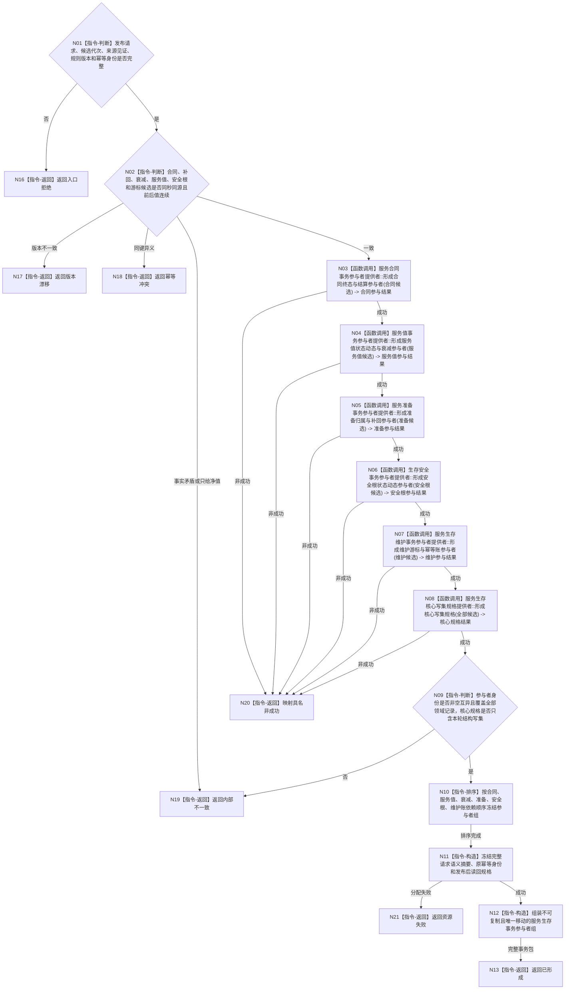

# BIZ-L4-003-02-05-01 形成服务生存事务参与者组目标函数流程图 v0.1

更新时间：2026-08-03

## 依据

```text
0050、4040、4190、6160、6170；BIZ-L3-003-02-05
```

## 身份与边界

正式目标函数设计图。把合同终态、结算阶段、服务值变化、衰减段、准备归属、生存安全根变化、维护游标和幂等账冻结为一个确定顺序的移动事务包；不准备候选、不确认、不发布。

## 函数合同

```text
根函数：服务生存数据操作::形成服务生存事务参与者组
归属模块 / 文件 / 层级：服务生存数据操作 / 海中鱼巣/领域/数据操作.服务生存治理.ixx / L4
现有或待新增：待新增；复用各具名领域事务参与者提供者和节点直接核心写集规格提供者
完整签名：服务生存参与者形成结果 服务生存数据操作::形成服务生存事务参与者组(const 服务生存事务发布请求& 请求) noexcept
参数：请求为只读借用；包含冻结合同终态/结算、服务值状态动态、补回与衰减段、准备归属、安全根状态动态、维护游标、幂等账、候选代次、来源见证向量和全部规则版本
返回结果：移动结果；含已形成、入口拒绝、版本漂移、幂等冲突、资源失败或内部不一致；成功时唯一携带不可复制的核心写集规格、确定排序参与者组、完整语义摘要和原幂等身份
被调函数流程图：各领域参与者提供者与核心写集规格提供者属于后续L5展开对象；本图冻结其调用次序、输入输出和聚合边界
父图：BIZ-L3-003-02-05
```

## 流程图



## 节点合同

| 节点 | 类型 | 参数 / 输入绑定 | 结果 / 输出绑定 | 事实读写 | 后继条件 | 验证 |
| --- | --- | --- | --- | --- | --- | --- |
| N01/N02 | 指令-判断 | 全部候选、见证和版本 | 合法、漂移、冲突或矛盾 | 无 | 同秒同源且值链连续才形成参与者 | 补回、衰减、回归分别记录，不以净值替代 |
| N03—N08 | 函数调用 | 各领域冻结候选 | 五类领域参与结果和一个核心规格结果 | 仅构造未发布事务材料 | 全部成功才聚合 | 30%预支不进入本写集；可选空分支有具名空参与结果 |
| N09/N10 | 指令-判断 / 排序 | 参与者身份和依赖 | 唯一确定顺序 | 无 | 非空互异且覆盖完整 | 空、重复、遗漏、循环依赖拒绝 |
| N11—N13/N16—N21 | 指令-构造 / 返回 | 完整事务材料 | 移动事务包或结构化非成功 | 无已发布变化 | 返回父图 | 所有权、资源失败、冲突和内部不一致分离 |

## 关键边界

- 本函数只冻结参与者和写集，不取得事务许可，不触碰仓库候选，也不产生发布见证。
- 某秒没有合同终态、准备补回或安全根变化时使用该领域合同允许的具名空分支，不得伪造哨兵事实；服务值维护游标和幂等账仍按真实推进参与事务。
- 核心写集、参与者组和发布后读回规格必须共享同一完整语义摘要；任何调用方不得取得单个参与者的确认、撤销或发布能力。

