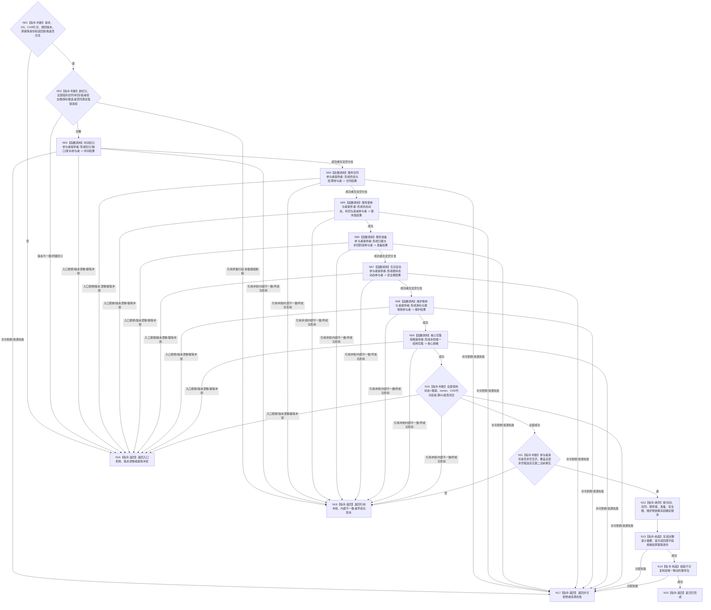

# BIZ-L4-003-02-05-01 形成服务生存事务参与者组目标函数流程图 v0.2

更新时间：2026-08-27

## 依据

```text
0050、4040、4050、4190、6160、6170
父图：BIZ-L3-003-02-05 v0.2
```

## 身份与边界

正式目标函数设计图。函数把新时间纪元/连续性缺口、合同终态与结算、服务值变化、补回与衰减段、准备归属、生存安全根变化、状态动态、维护游标和幂等账冻结成唯一移动事务包；只构造候选和读回规格，不取得事务许可、不触碰仓库、不发布事实。

## 函数合同

```text
根函数：服务生存数据操作::形成服务生存事务参与者组
归属模块 / 文件 / 目标分解深度：服务生存数据操作 / 海中鱼巣/领域/数据操作.服务生存治理.ixx / BIZ-L4
现有或待新增：待新增；HEAD无参与者provider或核心写集规格
完整签名：服务生存参与者形成结果 服务生存数据操作::形成服务生存事务参与者组(const 服务生存事务发布请求& 请求) noexcept
参数：请求为只读借用；含全部冻结候选、来源G0、各owner紧邻写入前CAS代次、规则版本、原幂等身份和联合读回规格
返回结果：已形成时唯一携带不可复制参与者组、核心写集、完整语义摘要、原幂等身份、来源G0和联合读回规格；其它状态空移动载荷
被调函数流程图：各唯一领域owner的事务参与者提供者与核心写集规格提供者；后续BIZ-L5展开其内部合同
```

## 流程图



## 节点合同

| 节点 | 类型 | 输入绑定 | 输出绑定 | 事实读写 | 后继条件 | 验证 |
| --- | --- | --- | --- | --- | --- | --- |
| N01/N02 | 判断 | 全候选、G0、CAS、版本和幂等 | 合法、漂移、冲突或矛盾 | 无 | 同源且值链连续 | 新纪元且N=0、N段、净值伪装 |
| N03—N10 | 调用 / 判断 | 各领域冻结候选 | 参与者和核心规格 | 仅内存候选材料 | 状态×载荷全部成功 | 具名空分支、owner/CAS/G0互证 |
| N11/N12 | 判断 / 排序 | 参与者身份和依赖 | 唯一确定顺序 | 无 | 非空互异且覆盖完整 | 漏、重、循环依赖、第二当前事实 |
| N13—N18 | 构造 / 返回 | 完整事务材料 | 移动事务包或空载荷非成功 | 无已发布变化 | 返回父图 | move所有权、分配失败、坏成功形状 |

## 关键边界

- 某段没有合同终态、准备补回或安全根变化时使用具名空分支；不得伪造哨兵事实。新纪元且N=0仍有真实时间/游标参与者。
- 30%预支不进入本写集；补回、衰减和安全回归分别保存，禁止只给净值。
- 核心写集、参与者组和联合读回规格共享同一完整语义摘要；调用方不得取得单参与者确认、撤销或发布能力。
