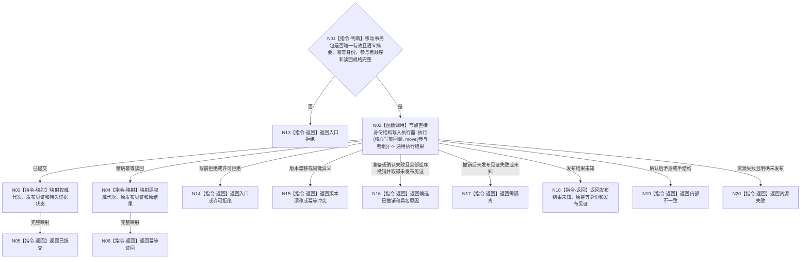

# BIZ-L4-003-02-05-02 执行服务生存统一事实写集目标函数流程图 v0.1

更新时间：2026-08-03

## 依据

```text
0050、4040、6160、6170；BIZ-L3-003-02-05；BIZ-L4-003-02-05-01
```

## 身份与边界

正式目标函数设计图。消费唯一移动事务包，在一个事务域内完成写前复核、全部候选准备和读回、全部确认以及最后内存代次原子发布；发布前失败逆序撤销，发布后不伪装回滚。

## 函数合同

```text
根函数：服务生存数据操作::执行服务生存统一事实写集
归属模块 / 文件 / 层级：服务生存数据操作 / 海中鱼巣/领域/数据操作.服务生存治理.ixx / L4
现有或待新增：待新增；复用节点直接身份结构写入执行器的通用事务入口
完整签名：服务生存写集执行结果 服务生存数据操作::执行服务生存统一事实写集(服务生存事务参与者组&& 参与者组) noexcept
参数：参与者组为右值并转移核心写集、确定顺序参与者、完整语义摘要、原幂等身份和读回规格的唯一所有权；调用后原对象不可再用
返回结果：值式结果；含已提交、幂等读回、入口拒绝、许可拒绝、版本漂移、幂等冲突、资源失败、候选已撤销、未发布见证失败需隔离、发布结果未知或内部不一致，以及权威代次、发布见证和持久证据状态
被调函数流程图：通用节点直接身份结构写入执行器作为已复用事务底座；服务参与者的内部准备/确认/撤销按后续L5提供者合同展开
父图：BIZ-L3-003-02-05
```

## 流程图



## 节点合同

| 节点 | 类型 | 参数 / 输入绑定 | 结果 / 输出绑定 | 事实读写 | 后继条件 | 验证 |
| --- | --- | --- | --- | --- | --- | --- |
| N01 | 指令-判断 | 唯一移动事务包 | 可执行或入口拒绝 | 无 | 完整才移交通用执行器 | move后单次消费；禁止单参与者泄漏 |
| N02 | 函数调用 | 核心写集回调和确定顺序参与者组 | 通用事务结果 | 候选准备、写后读回、确认、最后代次发布 | 通用结果完成 | 全准备、确定确认、依赖逆序撤销、唯一线性化点 |
| N03—N06 | 指令-映射 / 返回 | 已提交或精确重复结果 | 服务生存执行结果 | 无额外写入 | 返回父图 | 原幂等结果不推进版本、不重复结算 |
| N13—N20 | 指令-返回 | 具名失败状态 | 结构化非成功 | 发布前失败零普通可读事实 | 返回或隔离 | 发布未知只凭原幂等身份和见证收敛 |

## 关键边界

- 本函数不把合同、服务值、安全根或游标分成多个事务；参与者准备或确认期间普通读取仍只能看到旧代次。
- 发布前失败必须完成依赖逆序撤销；存在持久准备时还必须取得“本次尝试未发布”见证，否则进入隔离而不是声称已撤销。
- 内存代次切换后禁止撤销。SQL、材料、锁释放、函数返回或线程消息均不是发布点。

