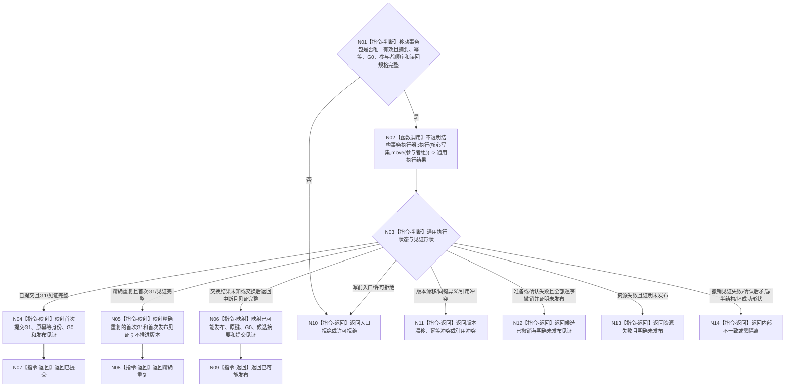

# BIZ-L4-003-02-05-02 执行服务生存统一事实写集目标函数流程图 v0.2

更新时间：2026-08-27

## 依据

```text
0050、4040、4050、6160、6170
父图：BIZ-L3-003-02-05 v0.2
```

## 身份与边界

正式目标函数设计图。函数消费唯一移动事务包，在一个事务域内完成写前复核、全部候选准备和写后读回、全部确认以及最后内存代次原子交换。发布前失败逆序撤销；交换后不得伪装回滚。它只返回执行状态、首次 `G1` 和提交见证，完整业务载荷必须由后继联合读回形成。

## 函数合同

```text
根函数：服务生存数据操作::执行服务生存统一事实写集
归属模块 / 文件 / 目标分解深度：服务生存数据操作 / 海中鱼巣/领域/数据操作.服务生存治理.ixx / BIZ-L4
现有或待新增：待新增；HEAD无该事务执行入口
完整签名：服务生存写集执行结果 服务生存数据操作::执行服务生存统一事实写集(服务生存事务参与者组&& 参与者组) noexcept
参数：右值事务包，转移核心写集、参与者、语义摘要、原幂等身份、来源G0和读回规格的唯一所有权
返回结果：已提交/精确重复携带原幂等身份、来源G0、首次G1和完整提交见证；已可能发布携带原键、G0、候选摘要和见证；明确未发布状态G1=0、无业务载荷
被调函数流程图：通用不透明结构事务执行器；参与者内部准备/确认/撤销在BIZ-L5展开
```

## 流程图



## 节点合同

| 节点 | 类型 | 输入绑定 | 输出绑定 | 事实读写 | 后继条件 | 验证 |
| --- | --- | --- | --- | --- | --- | --- |
| N01 | 判断 | 唯一移动事务包 | 可执行或入口拒绝 | 无 | 完整才移交执行器 | move后单次消费、坏摘要/顺序 |
| N02/N03 | 调用 / 判断 | 核心写集与确定参与者 | 通用事务状态 | 候选准备、写后读回、确认、最后交换 | 状态×见证闭合 | 全准备、逆序撤销、交换故障注入 |
| N04—N09 | 映射 / 返回 | 提交、重复或未知 | G0、首次G1和见证 | 无额外写入 | 返回父图 | 重复不推进、交换后中断 |
| N10—N14 | 返回 | 明确未发布或内部异常 | 结构化非成功 | 发布前零普通可读事实 | 返回或隔离 | 未发布见证、半结构、坏成功形状 |

## 关键边界

- 参与者准备或确认期间普通读取只能看旧代次；全部确认后只有一次内存代次交换形成 `G1`。
- 发布前失败必须依赖逆序撤销并取得“本次未发布”见证；否则进入内部不一致/隔离。
- 内存交换后禁止撤销；SQL、日志、锁释放、函数返回和线程消息均不是发布点。
