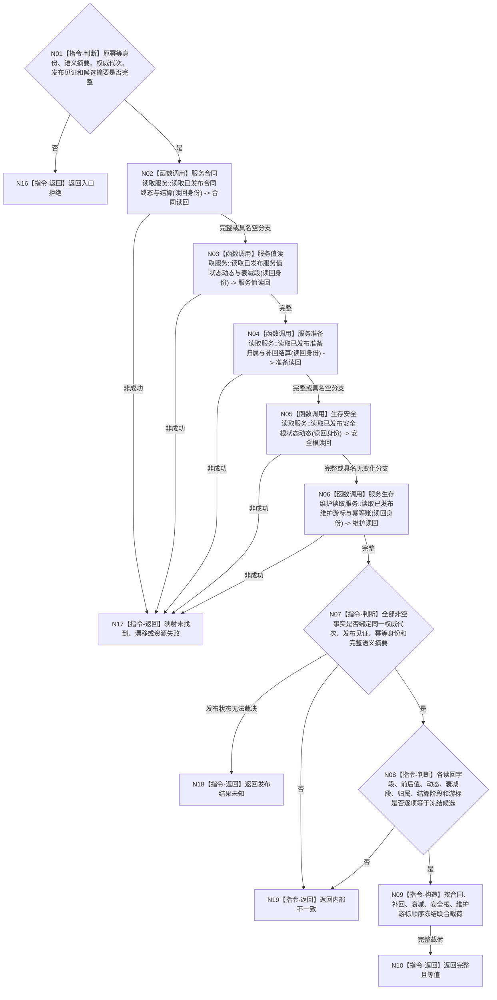

# BIZ-L4-003-02-05-03 联合读回已发布服务生存维护结果目标函数流程图 v0.1

更新时间：2026-08-03

## 依据

```text
0050、4040、6160、6170；BIZ-L3-003-02-05；BIZ-L4-003-02-05-02
旧鱼巢可吸收：实际结果与结算结构发布后独立回读再进入父链后继；排除线程回执、SQL和显示自证
```

## 身份与边界

正式目标函数设计图。绑定原幂等身份、完整语义摘要、权威代次和发布见证，从各唯一领域所有者读回同代次已发布事实并逐字段互证；不执行结算、不改变权限、不推进下一轮。

## 函数合同

```text
根函数：服务生存数据操作::联合读回已发布服务生存维护结果
归属模块 / 文件 / 层级：服务生存数据操作 / 海中鱼巣/领域/数据操作.服务生存治理.ixx / L4
现有或待新增：待新增组合读取；复用合同、服务值、衰减、准备、安全根和维护账具名只读服务
完整签名：服务生存联合读回结果 服务生存数据操作::联合读回已发布服务生存维护结果(const 服务生存联合读回请求& 请求) const noexcept
参数：请求为只读借用；含原幂等身份、冻结完整语义摘要、权威代次、发布见证、持久证据状态、候选逐字段摘要、可选空分支标记和各提供者截止见证
返回结果：不可变值式结果；含完整且等值、未找到、版本漂移、发布结果未知、资源失败或内部不一致，以及合同终态/结算、服务值状态动态、衰减段、准备归属/补回、安全根状态动态、维护游标、幂等账和联合发布见证
被调函数流程图：各唯一领域所有者的发布后只读入口属于后续L5展开对象；本图冻结组合次序、同代次互证和返回边界
父图：BIZ-L3-003-02-05
```

## 流程图



## 节点合同

| 节点 | 类型 | 参数 / 输入绑定 | 结果 / 输出绑定 | 事实读写 | 后继条件 | 验证 |
| --- | --- | --- | --- | --- | --- | --- |
| N02—N06 | 函数调用 | 原幂等身份、代次、见证和各领域稳定身份 | 五组已发布只读载荷 | 只读唯一领域所有者 | 完整或合同允许的具名空分支才继续 | 索引只召回，SQL/日志/缓存不补齐事实 |
| N07 | 指令-判断 | 五组读回与统一发布材料 | 同代次互证 | 无 | 唯一发布身份闭合 | 不拼接各自“最新”版本 |
| N08 | 指令-判断 | 读回逐字段与冻结候选 | 全字段等值性 | 无 | 完全相等才构造 | 补回、衰减和安全回归不可用净值替代 |
| N09/N10/N16—N19 | 指令-构造 / 返回 | 已互证材料或非成功 | 联合载荷或具名结果 | 无 | 返回父图 | 发布后缺失或矛盾进入审计/恢复路径 |

## 关键边界

- 联合读回必须绑定原请求的权威代次和发布见证，禁止从不同“当前最新”快照拼接一个看似完整结果。
- 合同终态、准备补回、服务衰减和安全根变化必须分别可审计；同秒最终值相同也不能省略发生过的增减与动态。
- 完整读回只证明服务生存维护写集成立，不证明需求满足、风险解除、任务已经取得权限或下一治理批次已经执行。
