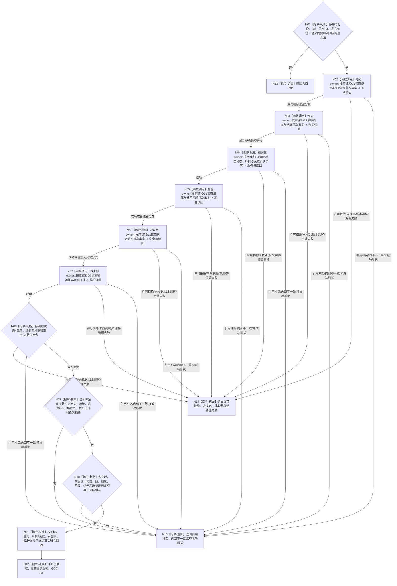

# BIZ-L4-003-02-05-03 联合读回已发布服务生存维护结果目标函数流程图 v0.2

更新时间：2026-08-27

## 依据

```text
0050、4040、4050、6160、6170
父图：BIZ-L3-003-02-05 v0.2
```

## 身份与边界

正式目标函数设计图。函数绑定原幂等身份和首次 `G1`，从各唯一领域owner读取同次首次发布事实并逐字段互证；它读取历史首次结果，不要求 `G1` 仍是当前代次，不拼接各领域“最新”快照，不执行结算、不推进下一轮。

## 函数合同

```text
根函数：服务生存数据操作::联合读回已发布服务生存维护结果
归属模块 / 文件 / 目标分解深度：服务生存数据操作 / 海中鱼巣/领域/数据操作.服务生存治理.ixx / BIZ-L4
现有或待新增：待新增组合读取；发布源码无该provider
完整签名：服务生存联合读回结果 服务生存数据操作::联合读回已发布服务生存维护结果(const 服务生存联合读回请求& 请求) const noexcept
参数：请求为只读借用；含原幂等身份、来源G0、首次G1、发布见证、冻结语义摘要、候选逐字段摘要和各唯一owner正式读回键
返回结果：已读取时携带合同终态/结算、服务值状态动态、补回与衰减段、准备归属、安全根状态动态、纪元/缺口/游标、幂等账、来源G0、首次G1和联合见证；其它状态空业务载荷、截止0
被调函数流程图：时间、合同、服务值、准备、安全根和维护账唯一owner的首次发布正式读回入口
```

## 流程图



## 节点合同

| 节点 | 类型 | 输入绑定 | 输出绑定 | 事实读写 | 后继条件 | 验证 |
| --- | --- | --- | --- | --- | --- | --- |
| N01 | 判断 | 原键、G0、G1、见证和摘要 | 合法入口 | 无 | 全部非零有效 | 坏键/见证/G1 |
| N02—N08 | 调用 / 判断 | 各owner首次读回键 | 六组同G1载荷 | 只读已发布历史事实 | 完整或合同允许空分支 | 首次发布、精确重复、推进后旧G1读回 |
| N09/N10 | 判断 | 六组读回与候选摘要 | 同发布与逐字段等值 | 无 | 完全一致才构造 | 漏/多/混G1/净值替代 |
| N11—N15 | 构造 / 返回 | 已互证材料或非成功 | 联合载荷或空业务载荷 | 无 | 返回父图 | 未找到、资源失败、内部不一致分账 |

## 关键边界

- `G1` 是首次发布和本次正式读回截止；来源事实仍保留 `G0`，两者不得混写。
- 精确重复与后续代次推进后仍按原幂等身份和首次 `G1` 读取首次完整载荷，禁止回退到“当前最新”。
- 完整读回只证明维护写集成立，不证明需求满足、风险解除、任务取得权限或后继循环已经执行。
