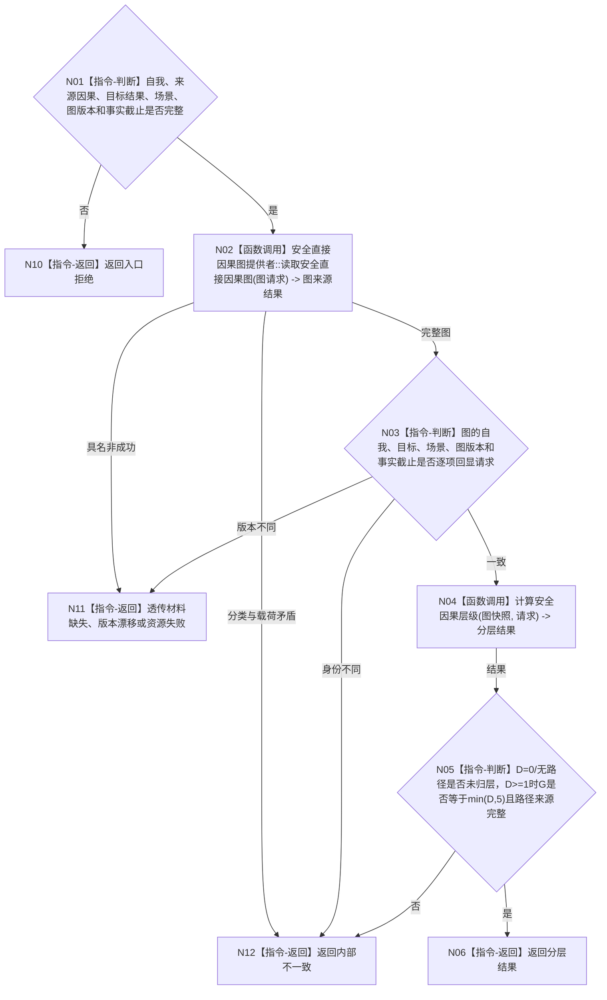

# BIZ-L4-003-03-02-01 读取安全因果分层目标函数流程图 v0.1

更新时间：2026-08-03

## 依据

```text
1190、4320、6150；BIZ-L3-003-03-02
当前代码：海中鱼巣/领域/服务.安全因果分层.ixx
```

## 身份与边界

正式目标函数设计图。按一个显式来源选择和固定图/事实截止读取不可变直接因果图，再计算到具体安全结果的当前最短深度；不枚举需求、不写因果、不截断深度到5。

## 函数合同

```text
根函数：安全因果分层服务::读取安全因果分层
归属模块 / 文件 / 层级：安全因果分层 / 海中鱼巣/领域/服务.安全因果分层.ixx / L4
现有或待新增：当前复用
完整签名：安全分层读取结果 安全因果分层服务::读取安全因果分层(const 安全分层读取请求& 请求) const
参数：请求为只读借用；含自我、来源因果信息、目标安全结果、适用场景、期望图版本和事实截止版本
返回结果：不可变值式结果；含已形成、未归层、入口拒绝、材料缺失、版本漂移、资源失败或内部不一致，以及真实精确深度、可选优先级组、全部同深度路径来源和输入版本
被调函数流程图：安全直接因果图提供者::读取安全直接因果图与计算安全因果层级属于后续L5展开对象
父图：BIZ-L3-003-03-02
```

## 流程图



## 节点合同

| 节点 | 类型 | 参数 / 输入绑定 | 结果 / 输出绑定 | 事实读写 | 后继条件 | 验证 |
| --- | --- | --- | --- | --- | --- | --- |
| N02 | 函数调用 | 自我、目标、场景、图版本、截止 | 不可变直接因果图 | 只读因果事实 | 完整才计算 | 反证、适用范围和非法环材料不丢失 |
| N03 | 指令-判断 | 来源图与请求 | 回显一致性 | 无 | 同快照才继续 | 不读取“最新”替代期望版本 |
| N04 | 函数调用 | 图快照和来源因果 | 精确深度、路径和组 | 无 | 纯值结果 | 确定性BFS、环、D=0/1/5/6/大深度 |
| N05/N06/N10—N12 | 指令-判断 / 返回 | 分层结果 | 结构化结果 | 无 | 返回父图 | 组5不覆盖真实D |

## 关键边界

深度没有业务上限；`G=min(D,5)` 只决定权限组。无路径和 `D=0` 都是未归层，不得伪装为组1、材料缺失或安全任务授权。
