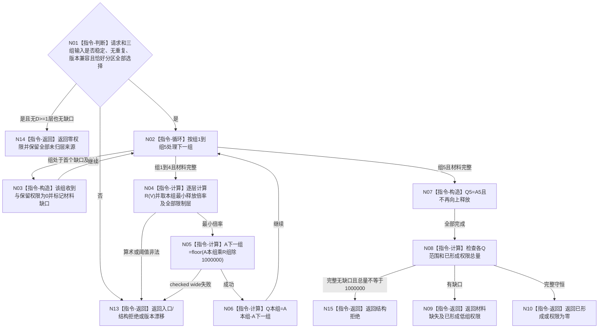

# BIZ-L4-003-03-02-03 计算安全五组权限目标函数流程图 v0.1

> 历史冻结（2026-08-27）：父图 `BIZ-L3-003-03-02 v0.1` 已退出当前003-03子树；五组纯值算法只作复用证据，不得施工或自动改挂。

更新时间：2026-08-03

## 依据

```text
6150；BIZ-L3-003-03-02
当前代码：海中鱼巣/领域/算法.安全任务权限.ixx
```

## 身份与边界

正式目标函数设计图。纯值计算五组递归权限、未归层来源和组级缺口；不读取事实、不应用6170安全根权限、不排序任务。

## 函数合同

```text
根函数：计算安全五组权限
归属模块 / 文件 / 层级：安全任务权限算法 / 海中鱼巣/领域/算法.安全任务权限.ixx / L4
现有或待新增：当前复用
完整签名：权限读取结果 计算安全五组权限(const std::vector<安全组层输入快照>& 有序层组, const std::vector<安全权限材料缺口>& 有序材料缺口组, const std::vector<安全权限层来源选择>& 有序未归层来源组, const 权限读取请求& 请求) noexcept
参数：四项均只读借用；三组输入必须稳定排序、无重复、恰好分区请求来源选择，层输入含D/G/V/值域/L/H和全部版本
返回结果：值式结果；含已形成、权限为零、材料缺失、入口拒绝、结构拒绝、版本漂移或资源失败，以及五组收到/保留/释放权限、限制层、未归层、缺口、已形成总量和版本
被调函数流程图：无；释放倍率、checked wide乘除、递归门控和守恒均为本函数内指令
父图：BIZ-L3-003-03-02
```

## 流程图



## 节点合同

| 节点 | 类型 | 参数 / 输入绑定 | 结果 / 输出绑定 | 事实读写 | 后继条件 | 验证 |
| --- | --- | --- | --- | --- | --- | --- |
| N01 | 指令-判断 | 三组输入与原选择 | 唯一完整分区 | 无 | 完整才计算 | 重复、遗漏、D/G、版本漂移 |
| N04 | 指令-计算 | 本组全部V/L/H | 最小R与限制层 | 无 | 缺层不默认安全 | 阈值等号、1%/99%、多层最小值 |
| N05/N06/N07 | 指令-计算 / 构造 | 递归收到权限 | 五组保留权限 | 无 | checked wide | 四道释放门、空组不赠予 |
| N08—N10/N13—N15 | 指令-计算 / 返回 | 五组结果 | 守恒结果或具名非成功 | 无 | 返回父图 | 完整时总量精确1000000 |

## 关键边界

组5只汇总权限，真实D始终保留。没有任何适用层时不得凭空给组1满权限；材料缺口也不得用零值伪装完整守恒。
