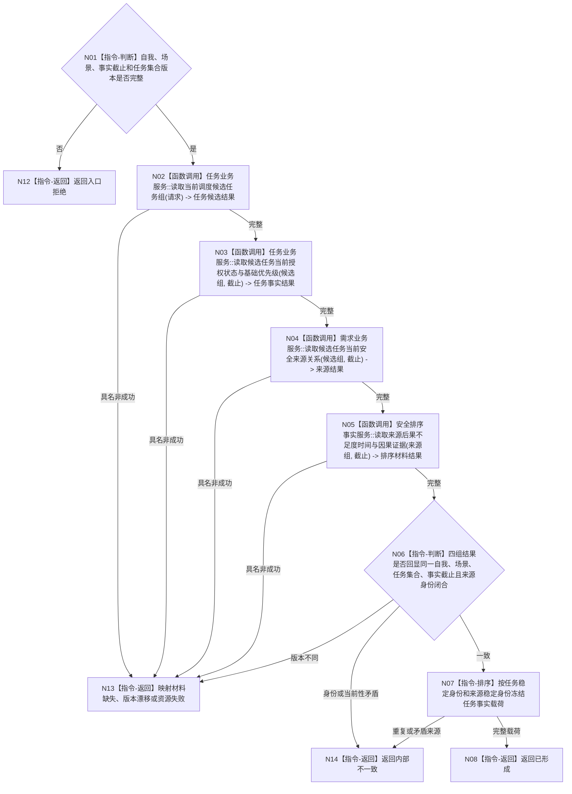

# BIZ-L4-003-03-03-01 读取安全任务事实目标函数流程图 v0.1

更新时间：2026-08-03

## 依据

```text
3200、5200、6150；BIZ-L3-003-03-03
当前抽象端口：海中鱼巣/领域/服务.安全任务权限.ixx
```

## 身份与边界

正式目标函数设计图。按显式自我、场景、事实截止和任务集合版本读取候选任务、授权、状态、基础优先级及正式安全来源关系；不从任务句柄反推场景或版本，不计算权限。

## 函数合同

```text
根函数：安全任务事实提供者::读取安全任务事实
归属模块 / 文件 / 层级：安全任务事实提供者 / 海中鱼巣/领域/提供者.安全任务事实.ixx / L4
现有或待新增：抽象端口当前存在；具体提供者待新增或适配任务业务只读服务
完整签名：安全任务事实来源结果 安全任务事实提供者::读取安全任务事实(const 安全任务事实来源请求& 请求) const
参数：请求为只读借用；含自我、适用场景、事实截止版本和任务集合版本
返回结果：不可变值式结果；含已形成、材料缺失、版本漂移、资源失败或内部不一致，以及候选任务组、任务安全关联组、后果/不足度/时间/因果证据材料、来源版本和实际消费见证
被调函数流程图：任务、需求、因果和安全结果领域的具名只读服务属于后续L5展开对象；索引只召回候选
父图：BIZ-L3-003-03-03
```

## 流程图



## 节点合同

| 节点 | 类型 | 参数 / 输入绑定 | 结果 / 输出绑定 | 事实读写 | 后继条件 | 验证 |
| --- | --- | --- | --- | --- | --- | --- |
| N02/N03 | 函数调用 | 显式集合版本和截止 | 当前候选、授权、状态、B | 只读任务事实 | 完整才读来源 | 等待、队列位置、线程号不修改B |
| N04 | 函数调用 | 候选任务和截止 | 正式来源需求、因果和目标关系 | 只读任务/需求事实 | 当前来源才保留 | 目标等价、多需求、失效来源 |
| N05 | 函数调用 | 来源组和截止 | U/T/C/K及适用性与版本 | 只读具名事实 | 不适用与缺失分离 | 版本号不进入强弱排序 |
| N06—N08/N12—N14 | 指令-判断 / 排序 / 返回 | 全部读回 | 稳定事实载荷或非成功 | 无 | 返回父图 | 不拼接不同截止“最新”值 |

## 关键边界

提供者只返回调用方拥有的值式投影，不泄漏任务仓库、关系仓库、锁或索引。权限为零的任务仍可在事实载荷中出现；本函数不得删除、取消或失败任务。

