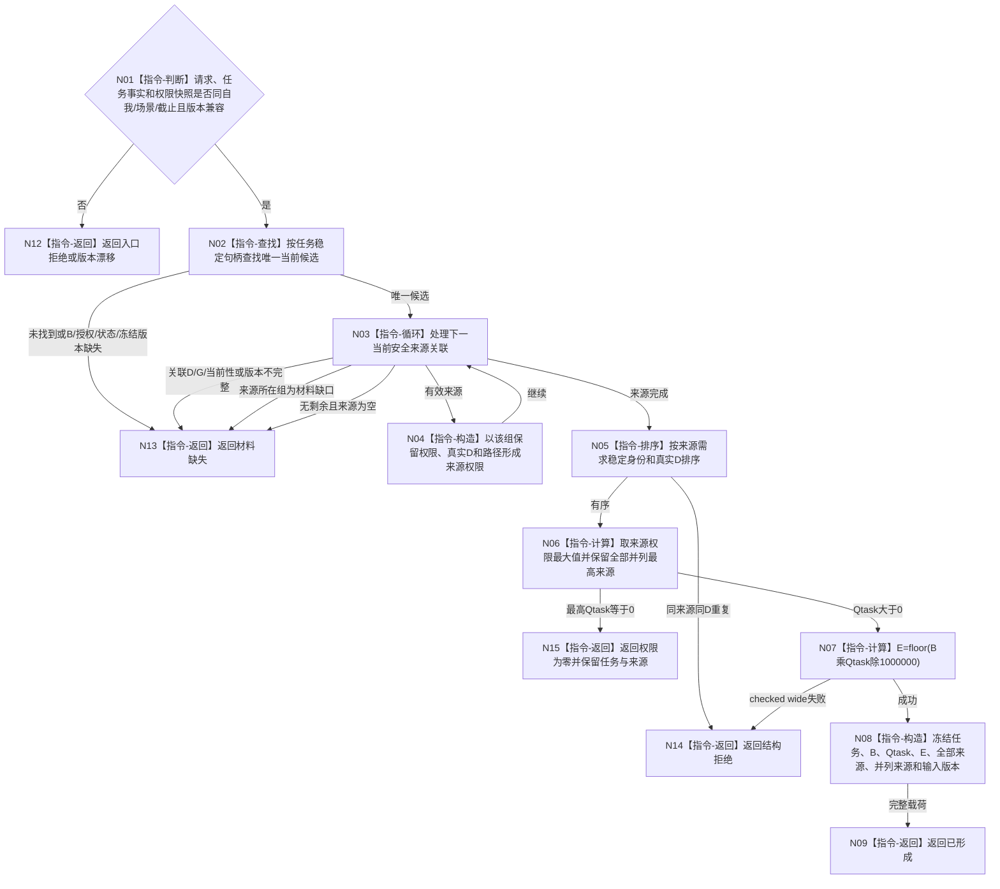

# BIZ-L4-003-03-03-02 计算单任务安全权限目标函数流程图 v0.1

更新时间：2026-08-03

## 依据

```text
5200、6150；BIZ-L3-003-03-03
当前代码：海中鱼巣/领域/算法.安全任务权限.ixx
```

## 身份与边界

正式目标函数设计图。纯值计算一个任务在安全任务类内部的最高来源权限和有效基础优先级；不乘6170安全根权限、不排序不同任务、不写任务事实。

## 函数合同

```text
根函数：计算单任务安全权限
归属模块 / 文件 / 层级：安全任务权限算法 / 海中鱼巣/领域/算法.安全任务权限.ixx / L4
现有或待新增：当前复用
完整签名：任务权限结果 计算单任务安全权限(const 安全任务事实来源载荷& 任务事实, const 权限读取载荷& 权限, const 任务权限请求& 请求) noexcept
参数：三项均只读借用；请求显式绑定自我、场景、任务、来源选择、事实截止、图版本、任务集合版本和权限规则版本
返回结果：值式结果；含已形成、权限为零、材料缺失、入口拒绝、结构拒绝、版本漂移或资源失败，以及任务B、安全类内Qtask/E、全部来源、并列最高来源和版本
被调函数流程图：无；候选查找、来源归并、最大值、并列保留和checked wide乘除均为本函数内指令
父图：BIZ-L3-003-03-03
```

## 流程图



## 节点合同

| 节点 | 类型 | 参数 / 输入绑定 | 结果 / 输出绑定 | 事实读写 | 后继条件 | 验证 |
| --- | --- | --- | --- | --- | --- | --- |
| N01/N02 | 指令-判断 / 查找 | 三组输入和任务身份 | 唯一当前候选 | 无 | 当前且完整才处理来源 | 集合/截止/图/权限版本漂移 |
| N03/N04 | 指令-循环 / 构造 | 当前安全关联与五组权限 | 逐来源安全类权限 | 无 | 只保留有效来源 | D/G、缺口和来源当前性 |
| N05/N06 | 指令-排序 / 计算 | 全部来源权限 | 最大值与并列来源 | 无 | 不求和 | 多需求、并列稳定顺序 |
| N07—N09/N12—N15 | 指令-计算 / 构造 / 返回 | B与Qtask | E和结构化结果 | 无 | 返回父图 | 结果可为0，不强制补1 |

## 关键边界

本结果尚未乘生存安全根权限；上层只能按6170再次向下取整。任务等待时长、队列位置、线程号和服务合同值均不得改变本函数的安全类内权限。
