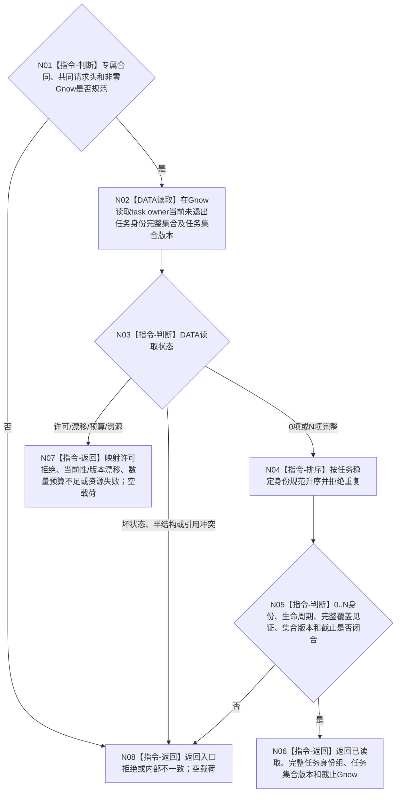

# BIZ-L4-003-03-05-01 读取当前任务身份全集与任务集合版本目标函数流程图 v0.1

更新时间：2026-08-27

## 依据

```text
0050、3200、4015、4230、4260、6150；BIZ-L3-003-03-05 v0.2
```

## 身份与边界

正式目标 DATA 读取叶。函数只在指定非零 `Gnow` 读取 task owner 当前未退出任务身份的 0..N 完整全集，并回显同一快照的非零任务集合版本。它不读取或判断任务主阶段、选择、冻结、排队、调度资格、授权或线程接管状态；“待普通派发”只能由父级 BIZ 组合器在读取 ARCH-L2 当前阶段后裁决。

当前发布源码尚无该公开读取入口，也没有正式冻结任务集合版本的唯一物理来源、递增边界和完整枚举 ABI。本图冻结所需的中性外部合同与禁止边界；精确 DTO 字段顺序、状态数值、集合版本 owner 和 DATA 内部索引 / 回源结构必须由后继 DATA 提供者设计闭合。不得把 `Gnow`、任务数量、哈希、线程本地计数或安全算法请求中的回显字段直接改名为任务集合版本。

## 函数合同

```text
根函数：L2任务结构服务::读取当前任务身份全集
归属模块 / 文件 / 目标分解深度：L2任务结构 / 海中鱼巣/领域/服务.L2任务结构.ixx / BIZ-L4调用叶（实际属于ARCH-L4兼容DATA公开面）
现有或待新增：待新增；HEAD无当前任务全集与任务集合版本公开读取ABI
完整签名：L2当前任务身份全集读取结果 L2任务结构服务::读取当前任务身份全集(const L2当前任务身份全集读取请求& 请求) const noexcept
参数：请求只读借用；至少含专属合同版本和期望事实代次为非零Gnow的共同L2请求头；不得含业务阶段、候选子集、线程槽或调度结论
返回结果：已读取时携带规范有序、无重复的0..N当前任务身份组、非零任务集合版本和正式读回截止Gnow；入口拒绝、许可拒绝、当前性漂移、版本漂移、数量预算不足、资源失败或内部不一致时载荷为空、截止0
被调函数流程图：无BIZ子图；DATA内部完整枚举、回源和集合版本形成必须在提供者详细设计中冻结
父图：BIZ-L3-003-03-05 v0.2；BIZ-L3-003-03-10 v0.4复用
```

## 流程图



## 节点合同

| 节点 | 类型 | 输入绑定 | 输出绑定 | 事实读写 | 验证 |
| --- | --- | --- | --- | --- | --- |
| N02/N03 | DATA读取 / 状态映射 | Gnow | 当前任务全集、集合版本、截止 | 只读task owner；无写入 | 0/1/N、许可、漂移、资源、数量预算 |
| N04/N05 | 排序 / 完整性 | DATA完整结果 | 唯一规范序与完整覆盖 | 无写入 | 漏项、额外项、重复、已退出项、混版本、截止错代 |
| N06—N08 | 返回 | 已验证结果或具名失败 | 完整成功或空失败 | 无写入 | 全部非成功零部分载荷 |

## 关键边界

- DATA只返回结构全集，不判断哪个任务已经完成执行冻结或尚未普通派发。
- 任务集合版本必须有独立权威来源和明确变化边界；`Gnow`只是一致性截止，不能自动冒充该版本。
- 非权威索引可以召回候选，但成功前必须在同一Gnow回源task owner并证明完整覆盖；仅扫描索引、容器、日志或任务管理槽不能返回已读取。
- 合法0项是完整成功；预算不足、索引不可用、许可拒绝和资源失败都不能冒充空全集。
- 具名缺口：`DRIFT-DATA-L2-TASK-CURRENT-SET-VERSION-AND-COMPLETE-ENUMERATION-ABI-UNFROZEN`。该缺口阻断代码施工，不阻断父级目标业务分层继续校正。
