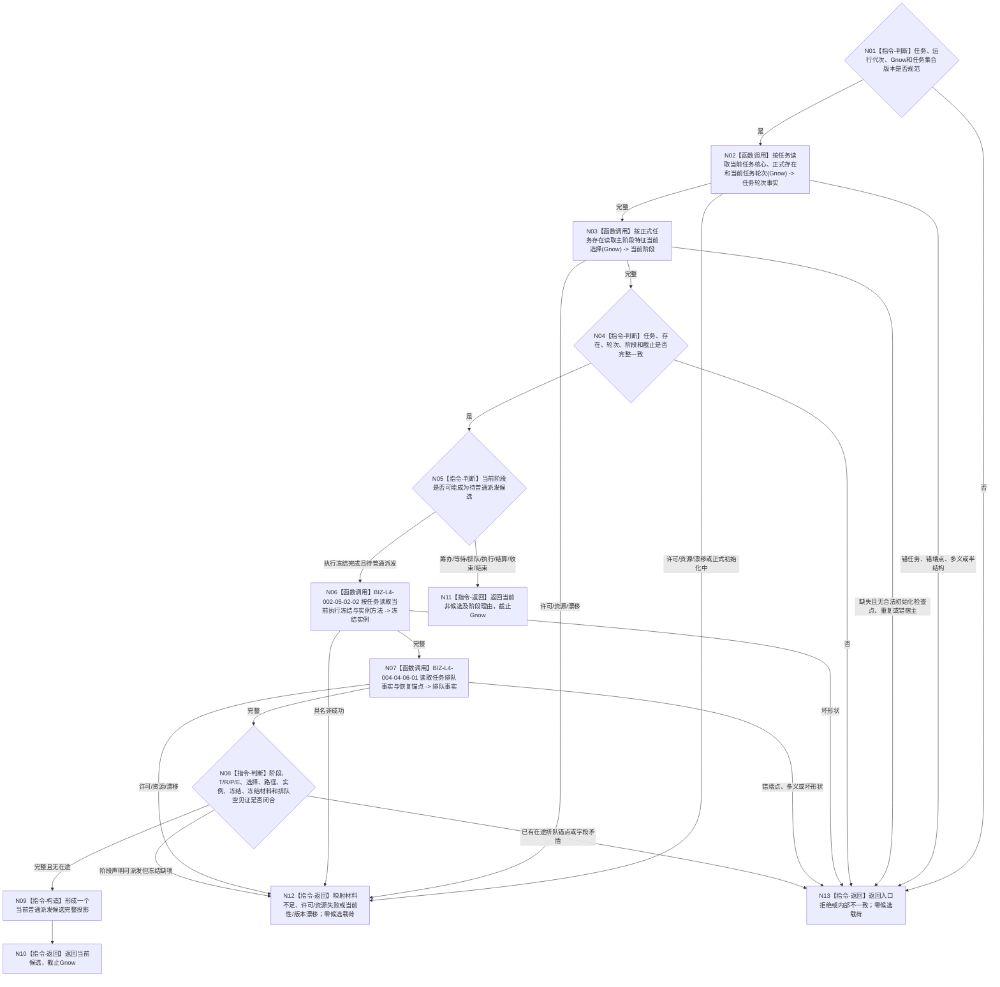

# BIZ-L4-003-03-05-02 读取一个任务的当前普通派发候选事实目标函数流程图 v0.1

更新时间：2026-08-27

## 依据

```text
0050、3200、4230、4260、5090、5230、8100、8200；BIZ-L3-003-03-05 v0.2
复用：BIZ-L4-002-05-02-02 v0.2、BIZ-L4-004-04-06-01 v0.1
```

## 身份与边界

正式目标 BIZ 读取叶。函数针对 L4-003-03-05-01 完整任务全集中的一个任务，在同一 `Gnow` 读取任务核心与当前轮次、正式 `T→E` 所指任务存在、ARCH-L2 当前主阶段状态、当前选择 / 路径 / 实例 / 执行绑定冻结，以及当前排队事实 / 恢复锚点；随后只在 BIZ 层判断该任务是否是“执行冻结完成且尚未普通派发”的当前候选。

函数不让 task owner 按业务阶段筛选，不从兼容旧任务治理状态、线程槽、队列位置或调用方缓存补造阶段。任务处于筹办、等待、排队、执行、结算、收束、结束或有正式初始化检查点但尚未形成完整阶段时，返回结构化“当前非候选”；只有阶段声明已可普通派发却缺选择 / 冻结 / 实例，或阶段与排队锚点矛盾时才是材料不足或内部不一致。

## 函数合同

```text
根函数：任务普通派发候选事实提供者::读取一个任务的当前普通派发候选事实
归属模块 / 文件 / 目标分解深度：任务普通派发候选事实提供者 / 海中鱼巣/领域/内部治理/提供者.任务普通派发候选事实.ixx / BIZ-L4
现有或待新增：待新增；发布源码有部分任务选择读取，缺当前任务/轮次、ARCH-L2阶段与排队事实的同Gnow完整组合
完整签名：单任务普通派发候选事实读取结果 任务普通派发候选事实提供者::读取一个任务的当前普通派发候选事实(const 单任务普通派发候选事实读取请求& 请求) const noexcept
参数：请求只读借用；含一个L2任务身份、运行代次、非零Gnow和L4-05-01返回的非零任务集合版本
返回结果：当前候选时携带任务、任务轮次、筹办轮次、执行轮次、路径、选择、实例、执行冻结、冻结材料、当前阶段和排队空见证；当前非候选时携带规范化阶段理由但不携带候选载荷；其它为入口拒绝、材料不足、当前性漂移、版本漂移、许可拒绝、资源失败或内部不一致且候选载荷为空
被调函数流程图：复用BIZ-L4-002-05-02-02读取当前选择/冻结/实例；复用BIZ-L4-004-04-06-01读取排队事实/恢复锚点；任务核心/轮次和ARCH-L2当前阶段走各自公开DATA读取，不展开DATA内部实现
父图：BIZ-L3-003-03-05 v0.2；BIZ-L3-003-03-10 v0.4复用
```

## 流程图



## 节点合同

| 节点 | 类型 | 输入绑定 | 输出绑定 | 事实读写 | 验证 |
| --- | --- | --- | --- | --- | --- |
| N02—N04 | 组合读取 / 互证 | T、Gnow | T/E/当前R与ARCH-L2阶段 | 只读task、存在、特征/状态owner | 未找到、0/1/>1、错宿主、错截止、合法初始化窗口 |
| N05 | BIZ判断 | 当前阶段 | 候选可能性与非候选理由 | 无写入 | 全阶段互斥、未知阶段拒绝 |
| N06—N08 | 复用读取 / 完整性 | 候选任务、Gnow | 当前选择/路径/实例/冻结及无在途见证 | 只读task与排队事实 | 缺、多、重、错轮次、同任务异冻结、已有在途 |
| N09—N13 | 构造 / 返回 | 完整候选或具名非成功 | 单候选、非候选理由或空失败 | 无写入 | 非成功不携带部分候选 |

## 关键边界

- 当前阶段只能由正式任务存在上的 ARCH-L2 当前状态选择关系表达；task owner 的兼容旧治理状态不得参与裁决。
- 当前非候选是完整读取结果，不等于错误；但阶段已经声明可普通派发时，冻结 / 实例 / 路径缺项不能降格为非候选。
- 排队事实只用于证明尚未普通派发；物理队列槽、线程编号、到达顺序和任务管理本地候选组不是该事实。
- 本函数只形成候选事实，不计算生存控制、调度倍率、现实执行授权或安全硬否决。
