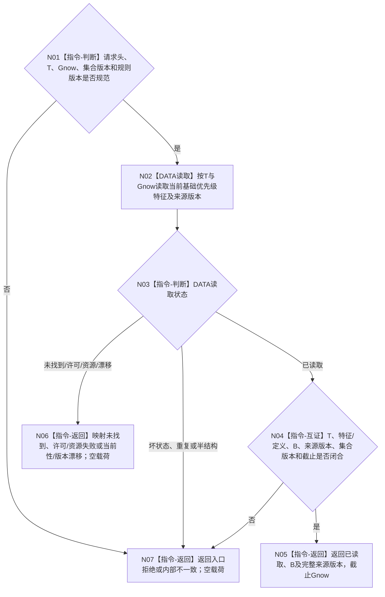

# BIZ-L4-003-03-07-01 读取任务当前基础优先级目标函数流程图 v0.1

更新时间：2026-08-27

## 依据

```text
0050、3200、4015、4230、4260、5200、6150
父图：BIZ-L3-003-03-07 v0.2；BIZ-L3-003-03-10 v0.3复用
```

## 身份与边界

正式目标 DATA 读取叶。函数只在指定非零 `Gnow` 读取任务 `T` 当前正式“任务基础优先级”特征值、定义/规则版本和可追溯来源版本。`B` 是5200任务结构长期保留的非负 `I64` 基础排序值，不含6150安全倍率、6170根配额、线程等待时间、队列位置或本轮有效执行优先级。

HEAD尚无该公开读取入口，也未冻结当前基础优先级特征实例、来源需求优先级与任务治理规则的联合读回 ABI。本图冻结中性读取边界；精确 DTO、状态值、特征映射和版本形成必须由后继 DATA 提供者设计闭合。

## 函数合同

```text
根函数：L2任务结构服务::读取任务当前基础优先级
归属模块 / 文件 / 目标分解深度：L2任务结构 / 海中鱼巣/领域/服务.L2任务结构.ixx / BIZ-L4调用叶（实际属于ARCH-L4兼容DATA公开面）
现有或待新增：待新增；HEAD无任务基础优先级当前正式读取ABI
完整签名：L2任务当前基础优先级读取结果 L2任务结构服务::读取任务当前基础优先级(const L2任务当前基础优先级读取请求& 请求) const noexcept
参数：共同L2请求头、任务T、非零Gnow、L3-05正式任务集合版本和任务基础优先级规则版本；不得携带调用方声明B或本轮调度倍率
返回结果：已读取时携带T、非负B、基础优先级特征/定义身份、来源需求优先级版本组、任务治理规则版本、任务集合版本和截止Gnow；其它状态零载荷、截止0
被调函数流程图：无BIZ子图；DATA内部特征映射、来源回源与当前版本形成由提供者详细设计冻结
```

## 流程图



## 节点合同

| 节点 | 类型 | 输入绑定 | 输出绑定 | 事实读写 | 验证 |
| --- | --- | --- | --- | --- | --- |
| N02/N03 | DATA读取 / 状态映射 | T、Gnow、集合/规则版本 | 当前B及来源版本 | 只读task owner正式特征；无写入 | 未找到、许可、漂移、资源、重复 |
| N04/N05 | 互证 / 返回 | DATA成功结果 | 非负B、来源和截止 | 无写入 | B为0合法；定义、来源、集合与Gnow同义 |
| N06/N07 | 返回 | 具名非成功 | 空载荷 | 无写入 | 非成功不得回显调用方声明值 |

## 关键边界

- `B=0`是完整当前事实，不等于材料缺失；它可能使后继有效执行优先级为0。
- 线程等待时长、队列位置、创建先后和服务/安全倍率不得写回或临时抬高B。
- 任务集合版本只用于证明读取属于L3-05同一候选全集，不参与B数值强弱。
- 具名缺口：`DRIFT-DATA-L2-TASK-BASE-PRIORITY-CURRENT-READ-ABI-UNFROZEN`。该缺口阻断代码施工，不授权遍历任务内部特征容器。
