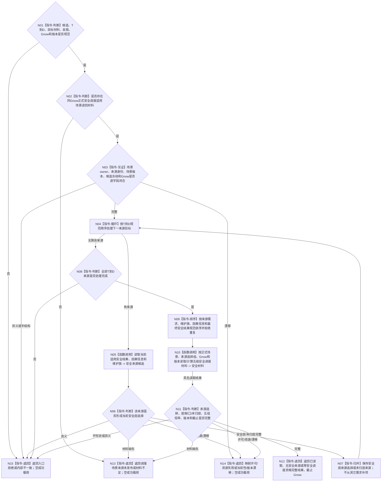

# BIZ-L4-003-03-07-02 读取候选当前安全来源调度材料目标函数流程图 v0.1

更新时间：2026-08-27

## 依据

```text
0050、3200、5200、5230、6140、6150、6170
父图：BIZ-L3-003-03-07 v0.2；BIZ-L3-003-03-10 v0.3复用其版本守卫
复用证据：BIZ-L4-003-03-02-01/03、BIZ-L3-003-01-01；旧003-03-02父图不恢复
```

## 身份与边界

正式目标 BIZ 读取叶。函数消费一个冻结候选、完整规范 `T→D` 组、逐来源目标材料，以及由正式上游在同一 `Gnow` 读回的“任务级安全调度适用场景”材料；随后按6150形成稳定无重复的安全层来源选择组，读取因果分层和安全维护事实，并计算完整五级安全调度材料。

安全调度适用场景表示本次执行上下文所在的统一场景容器：自我、控制设施和受影响存在可以是该场景中的不同存在。它不是自我当前位置，也不是某个动作的直接目标、观察范围、首个非空动作场景或公共祖先推导值。当前正式路径尚未发布该场景的唯一 producer、强类型字段和同Gnow读回合同，因此本函数当前只能冻结消费边界，不能形成可施工成功路径。

## 函数合同

```text
根函数：任务普通派发选择组合器::读取候选当前安全来源调度材料
归属模块 / 文件 / 目标分解深度：任务普通派发选择 / 海中鱼巣/领域/内部治理/服务.任务普通派发选择.ixx / BIZ-L4
可见性：module-private；只由BIZ-L3-003-03-07 v0.2调用
现有或待新增：待新增；因任务级安全调度适用场景正式来源未发布而不可施工
完整签名：候选安全来源调度材料读取结果 任务普通派发选择组合器::读取候选当前安全来源调度材料(const 候选安全来源调度材料读取请求& 请求) const noexcept
参数：请求只读借用；含候选当前冻结、完整T→D组、逐来源目标材料、正式安全调度适用场景读回材料、唯一自我、Gnow、图/值/阈值/权限规则期望版本；不接受裸场景身份、动作目标组或调用方自报来源选择组作为成功权威
返回结果：已读取、无安全来源、零安全调度资格、调度场景来源未发布、材料不足、当前性漂移、版本漂移、入口拒绝、许可拒绝、资源失败或内部不一致；三个完整状态携带规范来源选择、全部层/缺口/未归层、五组倍率、全部版本和截止Gnow
被调函数流程图：复用安全因果分层、已发布安全维护事实读取和计算安全五组倍率的既有合同；不恢复旧BIZ-L3-003-03-02父身份
```

## 流程图



## 节点合同

| 节点 | 类型 | 输入绑定 | 输出绑定 | 事实读写 | 验证 |
| --- | --- | --- | --- | --- | --- |
| N02/N03 | 正式来源互证 | 安全调度场景读回、候选冻结、Gnow | 唯一任务级调度场景材料 | 只读正式上游结果；无写入 | owner、来源、身份、版本、截止；当前producer缺失 |
| N04—N09 | 逐来源读取 / 归并 | 完整T→D和目标材料 | 规范安全层选择、未归层与缺口 | 只读需求、因果和安全owner | 每条关系守恒、零隐式枚举、稳定排序 |
| N10/N11 | 复用读取 / 算法 | 场景、选择、Gnow、版本 | 五级安全调度材料 | 只读安全事实；无写入 | 0/1/N层、缺口、未归层、守恒、混版本 |
| N12—N15 | 返回 | 完整材料或具名失败 | 完整结果或空失败 | 无写入 | 场景缺失不得降格为空安全来源 |

## 关键边界

- 安全调度适用场景必须是任务路径/冻结链显式生产并可同Gnow读回的统一上下文场景；当前正式 producer 未发布。
- 禁止从 self 所在位置、动作直接目标、观察范围、首动作场景、目标宿主或场景公共祖先反推调度场景。
- 空安全来源只有在正式调度场景存在、全部T→D来源均已裁定且0项适用时才完整；未取得场景不是合法空集。
- 具名缺口：`DRIFT-L4-FRESH-SCHEDULING-SCENE-SOURCE-UNDECLARED`。该缺口只阻断本安全来源调度读取及其父链，不回退L3-05/06或其它已闭合读取。
