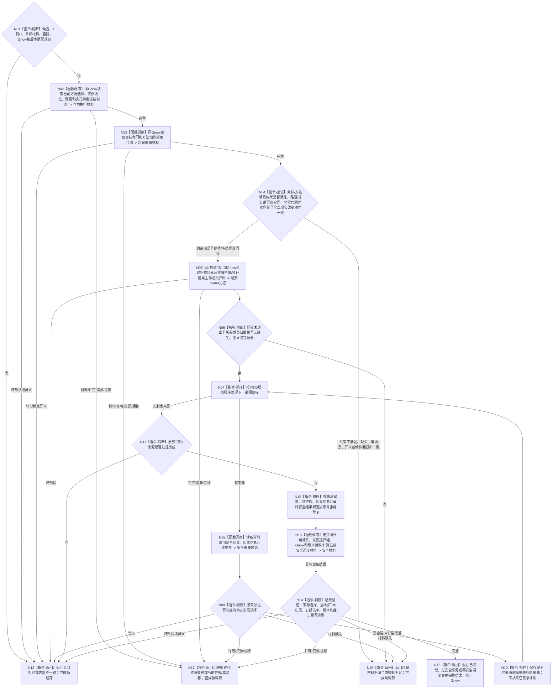

# BIZ-L4-003-03-07-02 读取候选当前安全来源调度材料目标函数流程图 v0.1

更新时间：2026-08-27

## 依据

```text
0050、3200、5200、5230、6140、6150、6170
父图：BIZ-L3-003-03-07 v0.2；BIZ-L3-003-03-10 v0.3复用其版本守卫
复用证据：BIZ-L4-003-03-02-01/03、BIZ-L3-003-01-01；旧003-03-02父图不恢复
```

## 身份与边界

正式目标 BIZ 读取叶。函数消费一个冻结候选、完整规范 `T→D` 组和逐来源目标材料，在同一 `Gnow` 独立读回当前方法选择、目标合同、方法动作适用合同、当前路径、执行绑定冻结材料和共同作用场景owner事实；全部来源逐字段互证后，按6150形成稳定无重复的安全层来源选择组，读取因果分层和安全维护事实，并计算完整五级安全调度材料。

共同作用场景表示本次观察分辨率下的统一执行上下文：自我、控制设施、直接作用主体和间接结果主体是其中不同的成员存在。它不是自我当前位置，也不是某个动作主体、结果主体、观察范围、首项场景或公共祖先推导值。共同作用场景不建立第二owner；正式来源就是目标/方法/路径/冻结中的同一强类型字段，场景owner只证明场景仍有效和所需成员归属闭合。

## 函数合同

```text
根函数：任务普通派发选择组合器::读取候选当前安全来源调度材料
归属模块 / 文件 / 目标分解深度：任务普通派发选择 / 海中鱼巣/领域/内部治理/服务.任务普通派发选择.ixx / BIZ-L4
可见性：module-private；只由BIZ-L3-003-03-07 v0.2调用
现有或待新增：待新增；目标合同已闭合，当前代码尚未贯穿共同作用场景字段、同Gnow互证和本读取叶
完整签名：候选安全来源调度材料读取结果 任务普通派发选择组合器::读取候选当前安全来源调度材料(const 候选安全来源调度材料读取请求& 请求) const noexcept
参数：请求只读借用；含候选当前冻结、完整T→D组、逐来源目标材料、唯一自我、Gnow、图/值/阈值/权限规则期望版本；不接受裸场景身份、动作目标组或调用方自报来源选择组作为成功权威
返回结果：已读取、无安全来源、零安全调度资格、场景材料不闭合、材料不足、当前性漂移、版本漂移、入口拒绝、许可拒绝、资源失败或内部不一致；三个完整状态携带共同作用场景互证见证、规范来源选择、全部层/缺口/未归层、五组倍率、全部版本和截止Gnow
被调函数流程图：复用BIZ-L4-002-05-02-02 v0.2所映射的当前选择/实例/冻结正式读取，并补读目标合同、方法动作适用合同、场景及成员归属；复用安全因果分层、安全维护事实读取和五组倍率既有合同；不恢复旧BIZ-L3-003-03-02父身份
```

## 流程图



## 节点合同

| 节点 | 类型 | 输入绑定 | 输出绑定 | 事实读写 | 验证 |
| --- | --- | --- | --- | --- | --- |
| N02—N04 | 正式来源读取 / 互证 | 候选、目标/方法/路径/冻结读取键、Gnow | 非零共同作用场景及完整来源见证 | 只读任务、目标和方法owner；无写入 | 目标/方法约束满足，路径/冻结身份、场景、版本、截止及动作回显逐字段闭合 |
| N05/N06 | 场景owner读取 / 判断 | 共同作用场景、直接主体和预计结果主体、Gnow | 场景有效与成员归属见证 | 只读场景owner；无写入 | 已退出、缺失、多义、错场景均不闭合 |
| N07—N12 | 逐来源读取 / 归并 | 完整T→D和目标材料 | 规范安全层选择、未归层与缺口 | 只读需求、因果和安全owner | 每条关系守恒、零隐式枚举、稳定排序 |
| N13/N14 | 复用读取 / 算法 | 共同作用场景、选择、Gnow、版本 | 五级安全调度材料 | 只读安全事实；无写入 | 0/1/N层、缺口、未归层、守恒、混版本 |
| N15—N18 | 返回 | 完整材料或具名失败 | 完整结果或空失败 | 无写入 | 场景不闭合不得降格为空安全来源 |

## 关键边界

- 共同作用场景由目标合同与方法动作适用合同共同确定适用约束，并由当前路径选择和执行绑定冻结材料显式冻结；目标/方法约束满足且路径/冻结在Gnow逐字段相同才形成正式互证见证，不存在独立场景producer。
- 禁止从 self 所在位置、动作直接目标、观察范围、首动作场景、目标宿主或场景公共祖先反推调度场景。
- 空安全来源只有在正式调度场景存在、全部T→D来源均已裁定且0项适用时才完整；未取得场景不是合法空集。
- 6150 v0.12已经撤回 `DRIFT-L4-FRESH-SCHEDULING-SCENE-SOURCE-UNDECLARED`。当前代码未实现字段贯穿、独立读回或失败映射时只能标为实现缺失；不得据此恢复旧DRIFT或降低成功合同。
