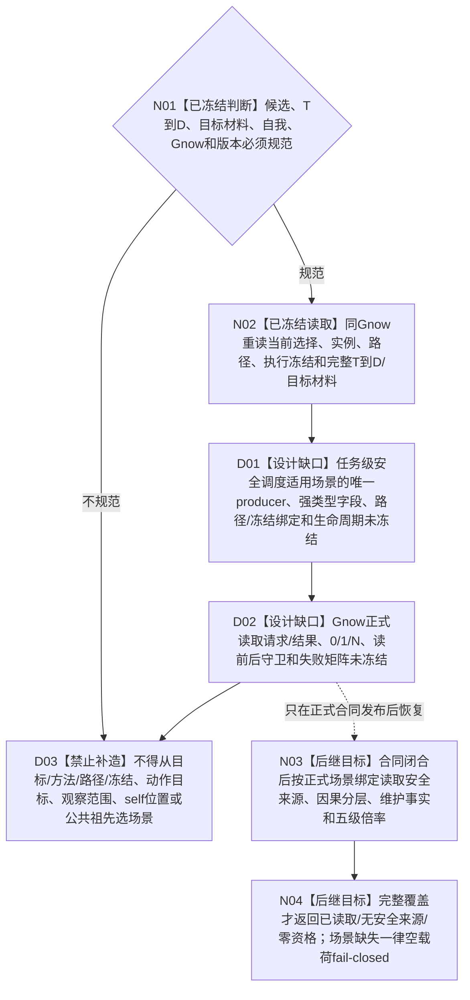

# BIZ-L4-003-03-07-02 读取候选当前安全来源调度材料目标函数流程图 v0.2

更新时间：2026-08-28

## 依据

```text
0050、3200、5200、5230、6140、6150、6170
父图：BIZ-L3-003-03-07 v0.3；BIZ-L3-003-03-10 v0.4复用其版本守卫
复用证据：BIZ-L4-003-03-02-01/03、BIZ-L3-003-01-01；旧003-03-02父图不恢复
```

## 身份与边界

目标读取叶设计缺口图。已经冻结的世界边界是：self、控制设施和受影响存在可以作为同一较高层场景中的不同存在，self 可改变控制设施特征并因果影响同场景内其它存在；这只否定把三个存在机械拆成三个互斥场景，不产生某一任务的安全调度适用场景读取键。

当前发布源码与正式规范尚未冻结任务级安全调度适用场景的唯一 producer、强类型字段、路径 / 执行冻结绑定、生命周期和 `Gnow` 正式读回矩阵。目标合同、方法动作适用合同、当前路径、执行绑定冻结材料、动作目标、观察范围、self 位置或公共祖先都不能被本叶自行选作该来源。因此本叶在来源合同闭合前不得调用现行单场景安全调度算法，也不得返回已读取、无安全来源或零安全调度资格。

## 函数合同

```text
根函数：任务普通派发选择组合器::读取候选当前安全来源调度材料
归属模块 / 文件 / 目标分解深度：任务普通派发选择 / 海中鱼巣/领域/内部治理/服务.任务普通派发选择.ixx / BIZ-L4
可见性：module-private；只由BIZ-L3-003-03-07 v0.3调用
现有或待新增：设计缺口；目标函数身份保留，完整 C++ ABI、DTO字段顺序和场景专属状态不得由本图生成
完整签名：未冻结；场景来源合同闭合前不得形成可施工签名
参数：已确定至少需要候选当前冻结、完整T→D组、逐来源目标材料、唯一自我、Gnow及图/值/阈值/权限规则期望版本；还必须消费上游正式提供并可在Gnow独立读回的任务级安全调度适用场景绑定，不接受调用方裸场景、动作目标组或自报来源选择组
返回结果：至少区分已读取、无安全来源、零安全调度资格、场景材料不闭合、材料不足、当前性/版本漂移、入口/许可拒绝、资源失败和内部不一致；成功形状必须携带正式场景绑定与读回见证，专属字段待上游合同闭合
被调函数流程图：安全因果分层、安全维护事实读取和五组倍率能力可复用；场景正式 producer / 读回叶未冻结，不伪列为现有被调函数
```

## 流程图



## 节点合同

| 节点 | 类型 | 输入绑定 | 输出绑定 | 事实读写 | 验证 |
| --- | --- | --- | --- | --- | --- |
| N01/N02 | 已冻结判断 / 读取 | 候选、T→D、目标材料、自我、Gnow和版本 | 可进入场景来源读取的前置材料 | 只读现有正式owner；无写入 | 不从需求列表或缓存补T→D，不从旧冻结补当前事实 |
| D01—D03 | 设计缺口 / 禁止补造 | 任务级安全调度适用场景需求 | 不形成可施工ABI或成功载荷 | 无写入 | 必须由正式规范和提供者合同闭合 |
| N03/N04 | 后继目标 | 未来正式场景绑定与完整来源材料 | 已读取、无安全来源、零资格或具名非成功 | 目标为只读安全/因果/场景owner | 当前不可达；合同发布后再展开逐函数流程 |

## 关键边界

- self、控制设施和受影响存在属于同一较高层场景的世界建模边界，不等于该任务的安全调度适用场景已经有正式producer。
- 禁止从 self 所在位置、动作直接目标、观察范围、首动作场景、目标宿主或场景公共祖先反推调度场景。
- 空安全来源只有在正式调度场景存在、全部T→D来源均已裁定且0项适用时才完整；未取得场景不是合法空集。
- 具名阻断为 `DRIFT-L4-FRESH-SCHEDULING-SCENE-SOURCE-UNDECLARED`。它只阻断本场景安全调度读取分支；候选全集、T→D、目标、基础优先级、服务合同和根调度快照等独立材料不回退。

## v0.2 校正记录

- 撤回 v0.1 把目标 / 方法 / 路径 / 冻结同值解释为正式场景来源的未授权结论。
- 保留用户确认的同一较高层场景世界边界，但明确它不生产任务级安全调度读取键。
- 在 producer、字段、绑定和同Gnow读回矩阵冻结前，本叶保持设计缺口，零安全调度成功。
