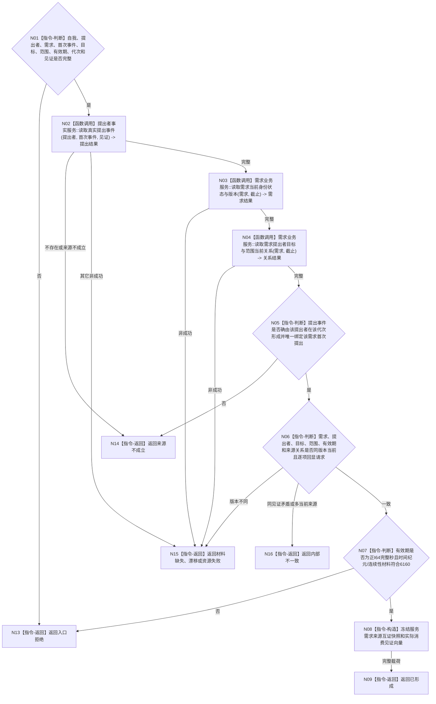

# BIZ-L4-003-04-01-01 读取提出者首次提出与需求来源互证目标函数流程图 v0.1

更新时间：2026-08-03

## 依据

```text
3100、5100、5110、5160、6160；BIZ-L3-003-04-01
```

## 身份与边界

正式目标函数设计图。读取一项服务需求的提出者、首次真实提出事件、需求当前版本、目标/范围正式关系、有效期材料和来源当前性并互证；不代替提出者续期，不读取法规或安全根。

## 函数合同

```text
根函数：服务合同准入事实提供者::读取提出者首次提出与需求来源互证
归属模块 / 文件 / 层级：服务合同准入事实提供者 / 海中鱼巣/领域/提供者.服务合同准入事实.ixx / L4
现有或待新增：待新增组合读取；复用提出者、需求和关系具名只读服务
完整签名：服务需求来源互证结果 服务合同准入事实提供者::读取提出者首次提出与需求来源互证(const 服务需求来源互证请求& 请求) const
参数：请求为只读借用；含自我、提出者、需求、首次提出事件、目标宿主/目标状态合同、服务范围、运行代次、提出时间纪元、有效期、事实截止和各提供者见证
返回结果：不可变值式结果；含已形成、材料缺失、来源不成立、当前性漂移、版本漂移、资源失败或内部不一致，以及提出者/事件/需求/目标/范围/有效期同源快照和实际消费见证向量
被调函数流程图：提出者事件、需求当前状态和正式关系具名只读服务属于后续L5展开对象
父图：BIZ-L3-003-04-01
```

## 流程图



## 节点合同

| 节点 | 类型 | 参数 / 输入绑定 | 结果 / 输出绑定 | 事实读写 | 后继条件 | 验证 |
| --- | --- | --- | --- | --- | --- | --- |
| N02 | 函数调用 | 提出者、首次事件和见证 | 已发布真实提出事实 | 只读提出者事实 | 真实且当前才继续 | 自我复制历史需求不得命中 |
| N03/N04 | 函数调用 | 需求、截止和请求身份 | 当前状态、目标/范围/提出者关系 | 只读需求与关系事实 | 同截止才互证 | 一需求一当前版本，历史隔离 |
| N05—N07 | 指令-判断 | 三组读回与有效期 | 同源、当前性和时间合法性 | 无 | 全部成立才构造 | 补充说明、自动续期、跨纪元缺证据 |
| N08/N09/N13—N16 | 指令-构造 / 返回 | 已互证材料 | 不可变快照或非成功 | 无 | 返回父图 | 缺失、来源不成立、漂移和内部不一致分离 |

## 关键边界

自我、任务、方法或历史合同不得代替提出者形成新提出事件。有效期届满后的新合同必须绑定提出者新的真实事件和新需求代次；本函数不推断续期。

