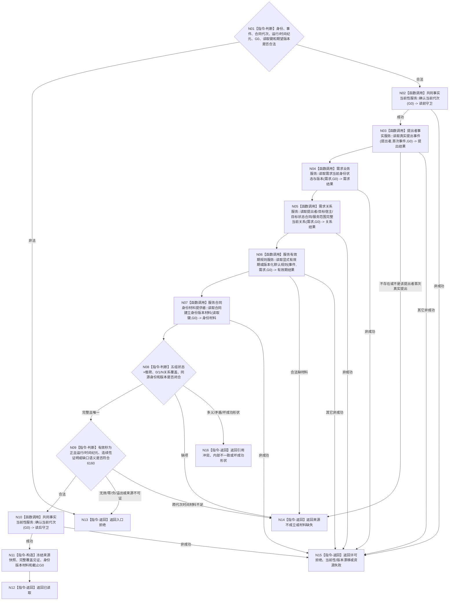

# BIZ-L4-003-04-01-01 读取提出者首次提出与需求来源互证目标函数流程图 v0.2

更新时间：2026-08-27

## 依据

```text
0050、4050、3100、5100、5110、5160、6160
父图：BIZ-L3-003-04-01 v0.2
```

## 身份与边界

正式目标函数设计图。以G0双守卫读取提出者真实提出事件、需求当前版本、目标/范围正式关系、有效期及合同建立身份版本材料，形成唯一同源快照；不自动续期、不读取法规/安全根、不生成写入身份。

## 函数合同

```text
根函数：服务合同准入事实提供者::读取提出者首次提出与需求来源互证
归属模块 / 文件 / 目标分解深度：服务合同准入事实提供者 / 海中鱼巣/领域/提供者.服务合同准入事实.ixx / BIZ-L4
现有或待新增：待新增组合读取；复用提出者、需求、关系与共同当前性中性服务
完整签名：服务需求来源互证结果 服务合同准入事实提供者::读取提出者首次提出与需求来源互证(const 服务需求来源互证请求& 请求) const noexcept
参数：请求含自我、提出者、需求、首次提出事件、合同代次、运行/时间纪元、G0、期望需求/关系/时间规则版本和合同建立身份版本材料读取键；不携带调用方构造的目标、范围或有效期事实
返回结果：已读取时携带提出事件、需求、目标/范围、显式或默认有效期来源、时间连续性状态、合同建立身份版本材料、完整覆盖见证和截止G0；其它状态空载荷截止0
被调函数流程图：提出者、需求、关系、时间规则及合同建立材料的中性叶属于后续更细分解；本图为当前必要BIZ读取叶
```

## 流程图



## 节点合同

| 节点 | 类型 | 输入绑定 | 输出绑定 | 事实读写 | 后继条件 | 验证 |
| --- | --- | --- | --- | --- | --- | --- |
| N02/N10 | 调用 | G0 | 读前/读后守卫 | 只读共同代次 | 两次成功才返回 | 前后漂移 |
| N03—N07 | 调用 | 正式读取键与G0 | 五组已发布材料 | 只读各owner事实 | 每组状态×载荷闭合 | 旧事件、旧需求、缺/多关系、显式/默认有效期 |
| N08—N09 | 判断 | 五组材料 | 唯一同源/时间合法性 | 无 | 0/1/N与时间分账 | 自动续期、跨纪元拼接、身份版本补造 |
| N11—N16 | 构造 / 返回 | 已互证材料 | 完整快照或非成功 | 无 | 返回父图 | 成功截止G0，非成功空载荷 |

## 关键边界

- 提出者未给有效期时可读取规则版本1的默认2,592,000秒，但不得伪装成提出者显式表达；无效显式值不能回退默认。
- 目标、范围、提出者和来源拓扑只来自正式关系；类型化合同记录不得复制这组拓扑。
- 合同建立身份版本材料是唯一provider结果，线程、服务、算法和事务参与者都不得生成、递增或替换。
