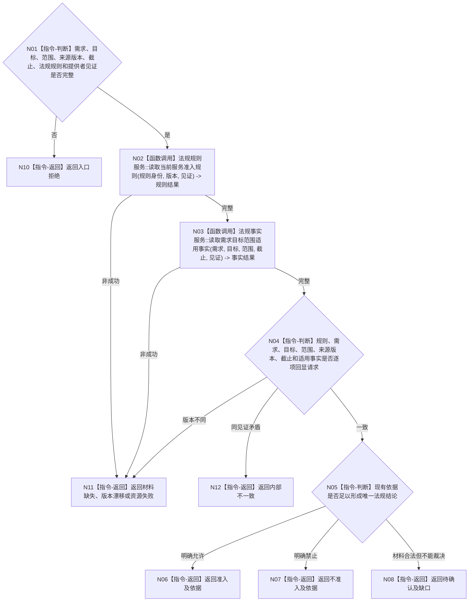

# BIZ-L4-003-04-01-02 读取服务需求法规准入结论目标函数流程图 v0.1

更新时间：2026-08-03

## 依据

```text
0050、5100、6160；BIZ-L3-003-04-01；BIZ-L4-003-04-01-01
```

## 身份与边界

正式目标函数设计图。按需求、目标、范围和冻结法规规则版本读取当前法规准入结论及依据；只返回准入、不准入或待确认，不建立合同、不增加服务值、不授予任务权限。

## 函数合同

```text
根函数：法规准入服务::读取服务需求法规准入结论
归属模块 / 文件 / 层级：法规准入 / 海中鱼巣/领域/服务.法规准入.ixx / L4
现有或待新增：待新增或适配现行法规判定提供者；不得从名称、日志或调用方声明推断
完整签名：法规准入读取结果 法规准入服务::读取服务需求法规准入结论(const 法规准入读取请求& 请求) const
参数：请求为只读借用；含提出者、需求、目标合同、服务范围、来源互证版本、事实截止、法规规则身份/版本和法规事实提供者见证
返回结果：不可变值式结果；含准入、不准入、待确认、材料缺失、版本漂移、资源失败或内部不一致，以及规则、适用范围、依据事实、形成版本和实际消费见证
被调函数流程图：法规规则与适用事实具名只读提供者属于后续L5展开对象
父图：BIZ-L3-003-04-01
```

## 流程图



## 节点合同

| 节点 | 类型 | 参数 / 输入绑定 | 结果 / 输出绑定 | 事实读写 | 后继条件 | 验证 |
| --- | --- | --- | --- | --- | --- | --- |
| N02 | 函数调用 | 规则身份、版本和见证 | 当前法规规则 | 只读规则事实 | 完整才读适用事实 | 规则换代、未知版本 |
| N03 | 函数调用 | 需求、目标、范围、截止 | 当前适用依据 | 只读法规事实 | 完整才裁决 | 范围漂移、来源版本 |
| N04/N05 | 指令-判断 | 规则和依据 | 回显一致性与三态结论 | 无 | 唯一可裁决才准入/拒绝 | 待确认不得当准入 |
| N06—N08/N10—N12 | 指令-返回 | 结论或非成功 | 结构化结果 | 无 | 返回父图 | 依据、版本和缺口可回查 |

## 关键边界

法规准入只决定能否建立服务合同和执行服务，不产生服务值、任务授权或需求满足事实。调用方传入的“合规”标签、方法名称、日志或控制面板显示均不得替代正式结论。

