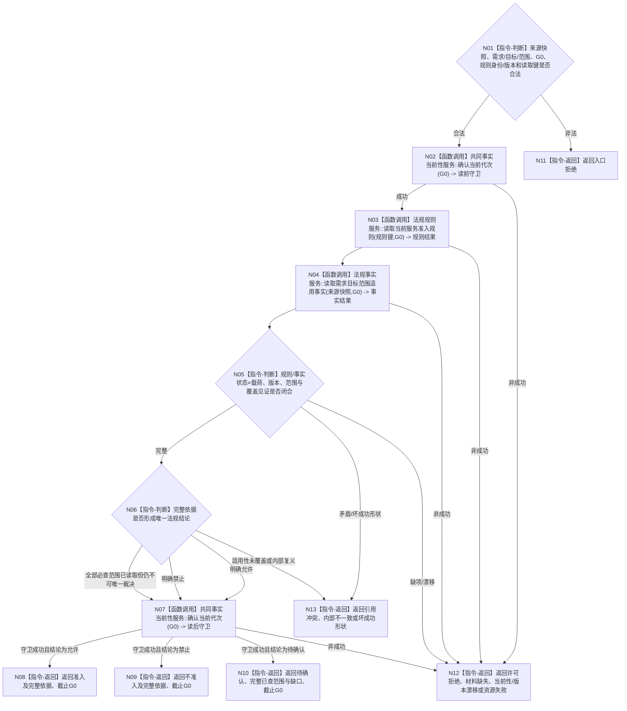

# BIZ-L4-003-04-01-02 读取服务需求法规准入结论目标函数流程图 v0.2

更新时间：2026-08-27

## 依据

```text
0050、4050、5100、6160
父图：BIZ-L3-003-04-01 v0.2
```

## 身份与边界

正式目标函数设计图。按同一G0读取当前法规规则、适用范围及需求事实，形成准入/不准入/待确认三态；不建立合同、不增加服务值、不判断需求满足，也不授予任务调度或现实执行权限。

## 函数合同

```text
根函数：法规准入服务::读取服务需求法规准入结论
归属模块 / 文件 / 目标分解深度：法规准入 / 海中鱼巣/领域/服务.法规准入.ixx / BIZ-L4
现有或待新增：待新增或适配正式法规provider；HEAD无可证明该业务合同的生产入口
完整签名：法规准入读取结果 法规准入服务::读取服务需求法规准入结论(const 法规准入读取请求& 请求) const noexcept
参数：请求含已互证的提出者/需求/目标/范围身份、来源快照身份/版本、G0、法规规则身份/版本和正式读取键；不携带调用方预判的合规bool
返回结果：三态结果均携带规则、适用范围、依据事实、形成版本、覆盖见证和截止G0；许可/材料/漂移/资源/内部非成功空载荷截止0
被调函数流程图：法规规则和适用事实中性读取属于后续更细分解
```

## 流程图



## 节点合同

| 节点 | 类型 | 输入绑定 | 输出绑定 | 事实读写 | 后继条件 | 验证 |
| --- | --- | --- | --- | --- | --- | --- |
| N02/N07 | 调用 | G0 | 双当前性守卫 | 只读共同代次 | 两次均成功 | 前后漂移 |
| N03—N05 | 调用 / 判断 | 规则、需求/目标/范围键 | 规则/事实完整覆盖 | 只读法规事实 | 状态×载荷先于业务裁决 | 规则换代、范围漂移、漏项/多项 |
| N06 | 判断 | 完整规则和事实 | 唯一三态 | 无 | 待确认是完整业务结论，不是假准入 | 明确允许/禁止/不足 |
| N08—N13 | 返回 | 三态或非成功 | 结构化结果 | 无 | 返回父图 | 三态载荷、其它空载荷 |

## 关键边界

- “待确认”表示必查范围已读取但证据不足以唯一裁决；provider漏读或适用性未覆盖属于非成功，不能降级为待确认。
- 调用方标签、名称、日志、界面或旧合同结论不能替代当前法规规则和事实。
- 法规准入只决定是否可继续建立合同；服务任务仍须另经当前调度、授权与安全复核。
