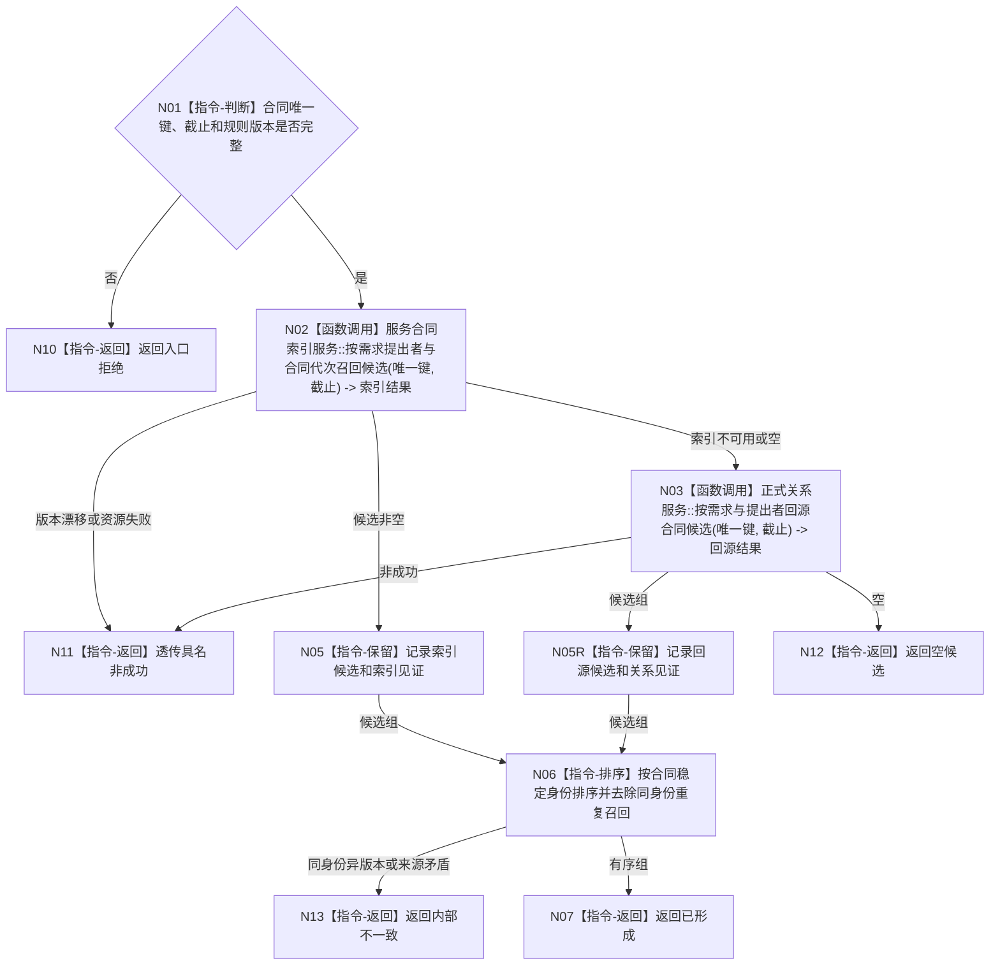

# BIZ-L4-003-04-02-01 定位同一有效需求合同候选目标函数流程图 v0.1

更新时间：2026-08-03

## 依据

```text
4010、4060、6160；BIZ-L3-003-04-02
```

## 身份与边界

正式目标函数设计图。用合同索引召回候选，索引不可用或未命中时按需求/提出者正式关系回源；只返回稳定候选身份，不裁决合同存在、当前性或唯一性。

## 函数合同

```text
根函数：服务合同读取服务::定位同一有效需求合同候选
归属模块 / 文件 / 层级：服务合同读取 / 海中鱼巣/领域/服务.服务合同读取.ixx / L4
现有或待新增：待新增；复用可重建索引和正式关系具名只读服务
完整签名：服务合同候选定位结果 服务合同读取服务::定位同一有效需求合同候选(const 当前服务合同读取请求& 请求) const
参数：请求为只读借用；含自我、提出者、需求、首次提出事件、合同代次、事实截止和合同规则版本
返回结果：不可变值式结果；含已形成、空候选、版本漂移、资源失败或内部不一致，以及稳定排序且去重的合同候选身份组、定位来源和实际消费见证
被调函数流程图：合同索引只读入口与正式关系回源入口属于后续L5展开对象
父图：BIZ-L3-003-04-02
```

## 流程图



## 节点合同

| 节点 | 类型 | 参数 / 输入绑定 | 结果 / 输出绑定 | 事实读写 | 后继条件 | 验证 |
| --- | --- | --- | --- | --- | --- | --- |
| N02 | 函数调用 | 合同唯一键与截止 | 索引候选 | 只读可重建索引 | 非空可直接返回候选 | 索引不作存在/不存在权威 |
| N03 | 函数调用 | 同一唯一键与截止 | 关系回源候选 | 只读正式关系 | 空是合法结果 | 索引故障、漏项和历史隔离 |
| N05/N05R/N06 | 指令-保留 / 排序 | 两种来源候选 | 稳定去重身份组 | 无 | 身份一致才返回 | 同身份异版本不得静默合并 |
| N07/N10—N13 | 指令-返回 | 定位状态 | 候选或具名非成功 | 无 | 返回父图 | 空候选不等于已证明无合同 |

## 关键边界

候选定位不是事实裁决。索引未命中必须允许关系回源；候选命中后仍须由下一函数完整回读合同关系、记录、状态和结算阶段。
