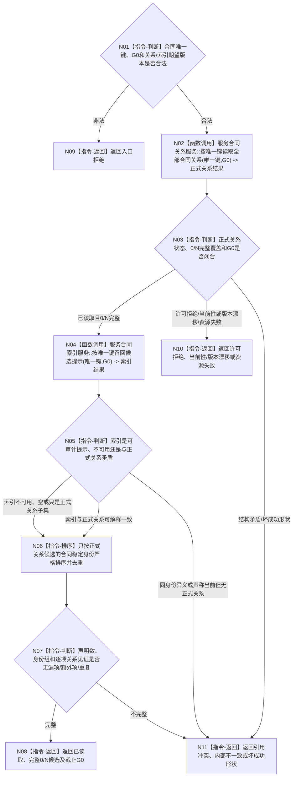

# BIZ-L4-003-04-02-01 定位同一有效需求合同候选目标函数流程图 v0.2

更新时间：2026-08-27

## 依据

```text
0050、4010、4050、6160
父图：BIZ-L3-003-04-02 v0.2
```

## 身份与边界

正式目标函数设计图。按合同唯一键和G0读取完整正式关系候选组，并把可重建索引只作为召回提示和一致性审计；候选结果不裁决合同当前、存在、唯一或精确重复。

## 函数合同

```text
根函数：服务合同读取服务::定位同一有效需求合同候选
归属模块 / 文件 / 目标分解深度：服务合同读取 / 海中鱼巣/领域/服务.服务合同读取.ixx / BIZ-L4
现有或待新增：待新增；正式关系0/N读取与可选索引适配待实现
完整签名：服务合同候选定位结果 服务合同读取服务::定位同一有效需求合同候选(const 当前服务合同读取请求& 请求) const noexcept
参数：请求含自我、提出者、需求、首次事件、合同代次、G0及关系/索引期望版本
返回结果：已读取时返回按合同稳定身份严格升序的0/N候选、正式关系声明数/覆盖见证、可选索引审计和截止G0；其它状态空载荷截止0
被调函数流程图：合同正式关系与索引中性读取属于后续更细分解
```

## 流程图



## 节点合同

| 节点 | 类型 | 输入绑定 | 输出绑定 | 事实读写 | 后继条件 | 验证 |
| --- | --- | --- | --- | --- | --- | --- |
| N02—N03 | 调用 / 判断 | 唯一键与G0 | 正式0/N关系覆盖 | 只读权威关系 | 这是完整性唯一来源 | 0/N、漏/多/重、错键 |
| N04—N05 | 调用 / 判断 | 同键同G0 | 可选索引提示 | 只读可重建索引 | 索引失败不否定正式关系 | 空、陈旧、子集、幽灵项 |
| N06—N08 | 排序 / 判断 / 返回 | 正式候选组 | 规范有序0/N结果 | 无 | 覆盖闭合才成功 | 稳定排序、声明数与见证 |
| N09—N11 | 返回 | 非成功 | 空载荷截止0 | 无 | 返回父图 | 状态×载荷 |

## 关键边界

- 索引不参与“0项合法空集”证明；即使索引命中，也必须由正式关系全集证明候选覆盖无遗漏。
- 历史和当前性由下一完整投影读取裁决。本函数不得仅凭关系或索引把候选称为当前合同。
- SQL、日志和缓存只可作为人读/恢复证据，不能补足正式关系覆盖。
