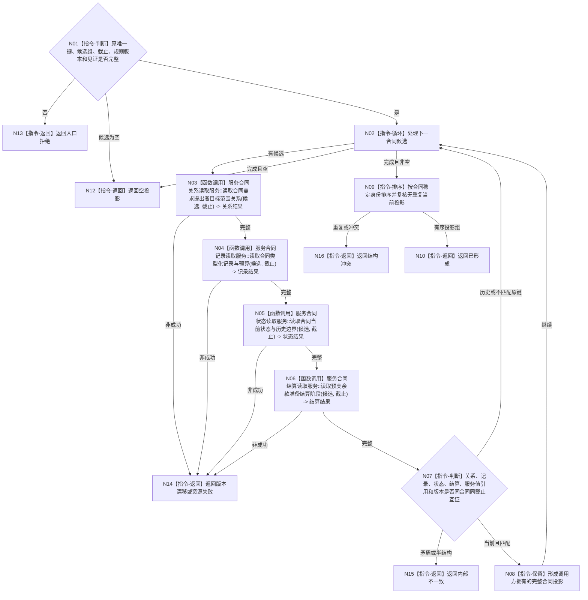

# BIZ-L4-003-04-02-02 回读当前服务合同完整投影目标函数流程图 v0.1

更新时间：2026-08-03

## 依据

```text
4010—4050、6160；BIZ-L3-003-04-02；BIZ-L4-003-04-02-01
```

## 身份与边界

正式目标函数设计图。逐候选回读正式关系、需求所属合同类型化记录、合同当前状态、预算与结算阶段、服务值引用和全部版本，筛出与唯一键匹配的当前完整合同投影；不建立或修改合同。

## 函数合同

```text
根函数：服务合同读取服务::回读当前服务合同完整投影
归属模块 / 文件 / 层级：服务合同读取 / 海中鱼巣/领域/服务.服务合同读取.ixx / L4
现有或待新增：待新增组合读取
完整签名：服务合同完整投影读取结果 服务合同读取服务::回读当前服务合同完整投影(const 服务合同完整投影读取请求& 请求) const
参数：请求为只读借用；含原合同唯一键、稳定候选身份组、事实截止、合同/状态/结算规则版本和各提供者见证
返回结果：不可变值式结果；含已形成、空投影、版本漂移、结构冲突、资源失败或内部不一致，以及稳定排序的当前完整合同投影组和实际消费见证向量
被调函数流程图：关系、合同记录、状态和结算阶段具名只读服务属于后续L5展开对象
父图：BIZ-L3-003-04-02
```

## 流程图



## 节点合同

| 节点 | 类型 | 参数 / 输入绑定 | 结果 / 输出绑定 | 事实读写 | 后继条件 | 验证 |
| --- | --- | --- | --- | --- | --- | --- |
| N03—N06 | 函数调用 | 候选身份和固定截止 | 关系、记录、状态、结算四组材料 | 只读唯一领域事实 | 全部完整才互证 | 半结构、历史/当前分离、版本漂移 |
| N07/N08 | 指令-判断 / 保留 | 四组材料与原唯一键 | 当前完整投影 | 无 | 当前且匹配才保留 | 合同键、预算、P0/P1、阶段闭合 |
| N09/N10 | 指令-排序 / 返回 | 全部当前投影 | 稳定投影组 | 无 | 无重复才返回 | 同有效需求多合同由父图报内部冲突 |
| N12—N16 | 指令-返回 | 空、漂移或矛盾 | 结构化非成功 | 无 | 返回父图 | 不用SQL/索引补齐缺失字段 |

## 关键边界

只有完整投影才能参与唯一性和幂等裁决。关系、记录、状态或结算任一缺失都不是“合同不存在”，也不得从 SQL、日志、缓存或界面拼接补齐。
