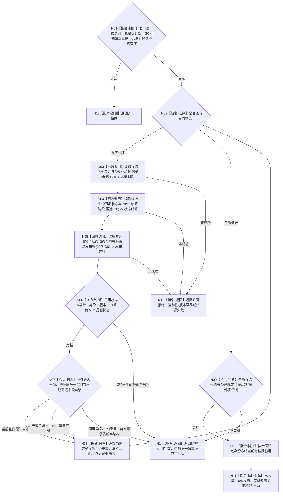

# BIZ-L4-003-04-02-02 回读当前服务合同完整投影目标函数流程图 v0.2

更新时间：2026-08-27

## 依据

```text
0050、4010、4050、6160
父图：BIZ-L3-003-04-02 v0.2；前置：BIZ-L4-003-04-02-01 v0.2
```

## 身份与边界

正式目标函数设计图。逐候选以同一G0回读关系、类型化记录、生命周期状态、P0/P1结算、服务值状态动态、幂等账及首次发布结果，筛出完整当前投影；任一缺项都不是“合同不存在”。

## 函数合同

```text
根函数：服务合同读取服务::回读当前服务合同完整投影
归属模块 / 文件 / 目标分解深度：服务合同读取 / 海中鱼巣/领域/服务.服务合同读取.ixx / BIZ-L4
现有或待新增：待新增组合读取
完整签名：服务合同完整投影读取结果 服务合同读取服务::回读当前服务合同完整投影(const 服务合同完整投影读取请求& 请求) const noexcept
参数：请求含原合同唯一键、完整有序候选身份组、原幂等身份、G0和各owner期望版本/读取键
返回结果：已读取时返回规范有序0/N当前完整投影；每项携带合同记录、正式关系、生命周期、结算、服务值变化、原幂等账、首次G1和首次完整载荷。其它状态空载荷截止0
被调函数流程图：关系、记录、状态、结算、服务值和幂等中性读取属于后续更细分解
```

## 流程图



## 节点合同

| 节点 | 类型 | 输入绑定 | 输出绑定 | 事实读写 | 后继条件 | 验证 |
| --- | --- | --- | --- | --- | --- | --- |
| N02—N05 | 选择 / 调用 | 单候选与固定G0 | 三组完整材料 | 只读各owner事实 | 每个候选全量读取 | 0/N、历史/当前、许可/资源/漂移 |
| N06—N08 | 判断 / 保留 | 三组材料与原键 | 当前完整投影或覆盖项 | 无 | 半结构立即失败 | 关系/记录/阶段/值/账/G1互证 |
| N09—N11 | 判断 / 排序 / 返回 | 全候选覆盖 | 规范0/N当前组 | 无 | 声明数逐项一致 | 漏/多/重、稳定排序 |
| N12—N14 | 返回 | 非成功 | 空载荷截止0 | 无 | 返回父图 | 状态×载荷 |

## 关键边界

- 当前服务值相同不能证明P0已结算；必须读回P0结算记录、服务值变化动态、原幂等账和首次完整结果。
- 同义当前合同必须保留首次G1和首次载荷；不得用当前最新状态重建“原结果”。
- 任一候选缺关系、记录、状态、结算、服务值或幂等材料都属于非成功/内部不一致，不得被过滤成不存在。
