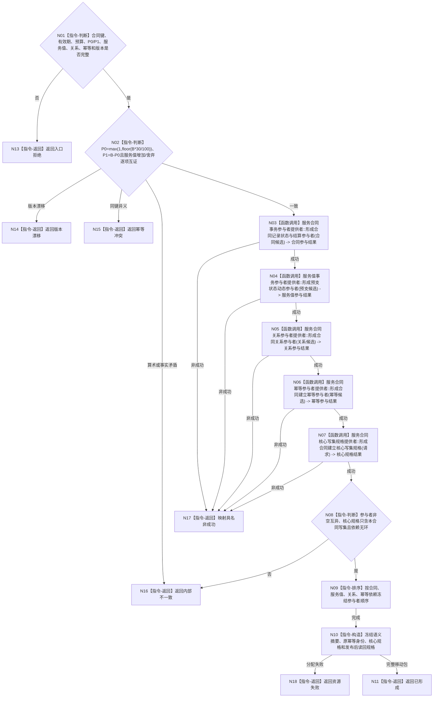

# BIZ-L4-003-04-04-01 形成合同建立预支事务参与者组目标函数流程图 v0.1

更新时间：2026-08-03

## 依据

```text
0050、4040、6160；BIZ-L3-003-04-04
```

## 身份与边界

正式目标函数设计图。把新合同、有效期、预算、P0/P1阶段、服务值预支变化、合同关系和幂等账冻结为一个移动事务包；不准备候选、不发布。

## 函数合同

```text
根函数：服务合同数据操作::形成合同建立预支事务参与者组
归属模块 / 文件 / 层级：服务合同数据操作 / 海中鱼巣/领域/数据操作.服务合同.ixx / L4
现有或待新增：待新增；复用合同、服务值、关系和幂等参与者提供者
完整签名：合同建立参与者形成结果 服务合同数据操作::形成合同建立预支事务参与者组(const 合同建立预支事务请求& 请求) noexcept
参数：请求为只读借用；含合同稳定身份/唯一键、需求归属、有效期、预算、P0/P1、服务值前后状态与动态、关系、结算阶段、候选代次、来源见证和规则版本
返回结果：移动结果；含已形成、入口拒绝、版本漂移、幂等冲突、资源失败或内部不一致；成功时唯一携带核心写集规格、确定顺序参与者组、完整语义摘要和读回规格
被调函数流程图：各领域参与者与核心写集规格提供者属于后续L5展开对象
父图：BIZ-L3-003-04-04
```

## 流程图



## 节点合同

| 节点 | 类型 | 参数 / 输入绑定 | 结果 / 输出绑定 | 事实读写 | 后继条件 | 验证 |
| --- | --- | --- | --- | --- | --- | --- |
| N01/N02 | 指令-判断 | 完整请求与预算公式 | 合法、漂移、冲突或矛盾 | 无 | 全部闭合才形成参与者 | I64_MAX、舍弃值、P0/P1仅一次 |
| N03—N07 | 函数调用 | 四类领域候选与完整请求 | 四类参与结果和核心规格 | 仅构造未发布事务材料 | 全部成功才聚合 | 合同与预支同事务，安全根不参与 |
| N08/N09 | 指令-判断 / 排序 | 参与者与核心规格 | 确定依赖顺序 | 无 | 非空互异无环 | 遗漏、重复和循环依赖拒绝 |
| N10/N11/N13—N18 | 指令-构造 / 返回 | 完整事务材料 | 移动事务包或非成功 | 无已发布变化 | 返回父图 | 不泄漏单参与者控制权 |

## 关键边界

预算在合同建立时冻结；任务拆分、等待、方法重试和服务数量不得扩大预算。参与者形成不等于合同或预支已经发布。
