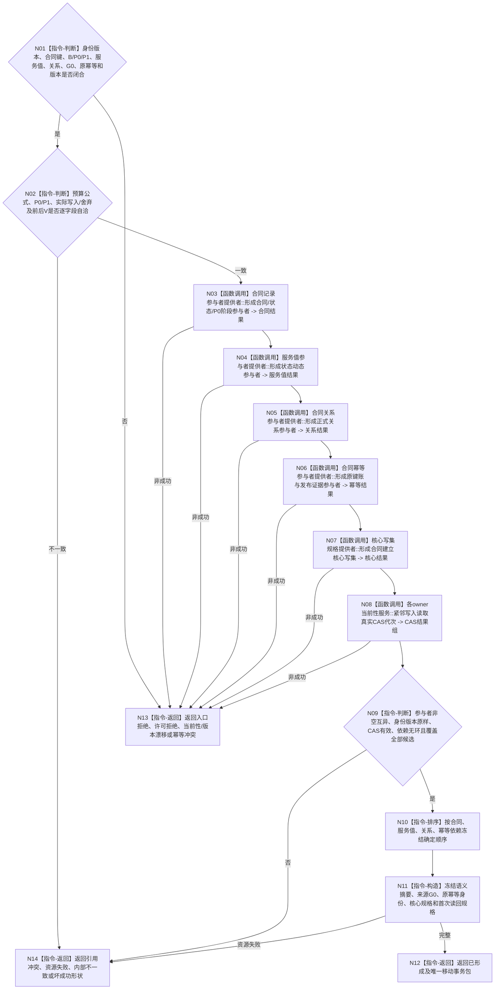

# BIZ-L4-003-04-04-01 形成合同建立预支事务参与者组目标函数流程图 v0.2

更新时间：2026-08-27

## 依据

```text
0050、4040、4050、6160
父图：BIZ-L3-003-04-04 v0.2
```

## 身份与边界

正式目标函数设计图。把合同记录/状态/结算、服务值状态动态、正式关系和幂等账候选封装为唯一移动事务包；只消费正式身份版本材料并在各owner紧邻写入前读取真实CAS代次，不发布事实。

## 函数合同

```text
根函数：服务合同数据操作::形成合同建立预支事务参与者组
归属模块 / 文件 / 目标分解深度：服务合同数据操作 / 海中鱼巣/领域/数据操作.服务合同.ixx / BIZ-L4
现有或待新增：待新增；复用4040事务参与者协议，各领域参与者provider待实现
完整签名：合同建立参与者形成结果 服务合同数据操作::形成合同建立预支事务参与者组(const 合同建立预支事务请求& 请求) noexcept
参数：请求含正式合同建立身份版本材料、合同键、B/P0/P1、服务值前后状态动态、关系、结算阶段、来源G0、原幂等身份、规则/格式版本和首次读回规格
返回结果：已形成时唯一携带核心写集规格、严格有序move-only参与者组、各owner CAS代次、语义摘要和首次读回规格；其它状态无移动载荷
被调函数流程图：各领域参与者provider与核心写集规格叶属于后续更细分解
```

## 流程图



## 节点合同

| 节点 | 类型 | 输入绑定 | 输出绑定 | 事实读写 | 后继条件 | 验证 |
| --- | --- | --- | --- | --- | --- | --- |
| N01—N02 | 判断 | 完整候选和正式材料 | 合法事务语义 | 无 | 不重算身份/版本 | 固定公式、错G0、同键异义 |
| N03—N08 | 调用 | 四类候选和各owner键 | 参与者、核心规格、CAS代次 | 只形成未发布候选/读取当前代次 | 全部成功才聚合 | 漏项、许可、漂移、分配失败 |
| N09—N12 | 判断 / 排序 / 构造 / 返回 | 全部参与者 | 唯一move-only包 | 无发布 | 非空互异、覆盖、无环 | 重复指针/键、错序、错代 |
| N13—N14 | 返回 | 非成功 | 无移动载荷 | 无 | 返回父图 | 状态×载荷 |

## 关键边界

- 来源G0只描述候选读取截止；每个owner的写入CAS代次必须在紧邻提交前从该owner真实读取，二者不得互相替代。
- 参与者形成不等于合同/P0已发布；不得向调用方泄漏单参与者控制权、会话或原始指针视图。
- 生存安全根不在本事务参与者组中；合同建立本身零安全根写入。
