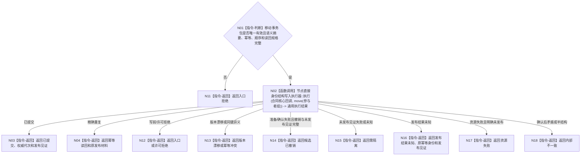

# BIZ-L4-003-04-04-02 执行合同建立预支统一事实写集目标函数流程图 v0.1

更新时间：2026-08-03

## 依据

```text
0050、4040、6160；BIZ-L3-003-04-04；BIZ-L4-003-04-04-01
```

## 身份与边界

正式目标函数设计图。消费合同建立移动事务包，在一个事务域内完成第一写前唯一性复核、全候选准备/读回、确认和最后发布；发布前失败逆序撤销。

## 函数合同

```text
根函数：服务合同数据操作::执行合同建立预支统一事实写集
归属模块 / 文件 / 层级：服务合同数据操作 / 海中鱼巣/领域/数据操作.服务合同.ixx / L4
现有或待新增：待新增；复用节点直接身份结构写入执行器通用事务入口
完整签名：合同建立写集执行结果 服务合同数据操作::执行合同建立预支统一事实写集(合同建立预支事务参与者组&& 参与者组) noexcept
参数：参与者组为右值并转移核心规格、确定顺序参与者、语义摘要、原幂等身份和读回规格唯一所有权
返回结果：值式结果；含已提交、幂等读回、入口/许可拒绝、版本漂移、幂等冲突、资源失败、候选已撤销、需隔离、发布结果未知或内部不一致，以及权威代次、发布见证和持久证据状态
被调函数流程图：节点直接身份结构写入执行器为复用事务底座；参与者内部函数后续L5展开
父图：BIZ-L3-003-04-04
```

## 流程图



## 节点合同

| 节点 | 类型 | 参数 / 输入绑定 | 结果 / 输出绑定 | 事实读写 | 后继条件 | 验证 |
| --- | --- | --- | --- | --- | --- | --- |
| N01 | 指令-判断 | 唯一移动事务包 | 可执行或入口拒绝 | 无 | 完整才移交 | move单次消费 |
| N02 | 函数调用 | 合同核心回调和参与者组 | 通用事务结果 | 全候选准备、读回、确认和最后发布 | 结果完成 | 第一写前重复合同/预支拒绝，依赖逆序撤销 |
| N03/N04 | 指令-返回 | 提交或原幂等结果 | 发布材料 | 无额外写入 | 返回父图 | 重复不再支付P0 |
| N11—N18 | 指令-返回 | 具名失败 | 结构化非成功 | 发布前零普通可读事实 | 返回或隔离 | 发布未知只按原身份收敛 |

## 关键边界

合同、P0阶段、服务值状态动态、关系和幂等账必须同代次成立。发布前失败可撤销；发布后不得撤销或用 SQL 旧行伪装回滚。

