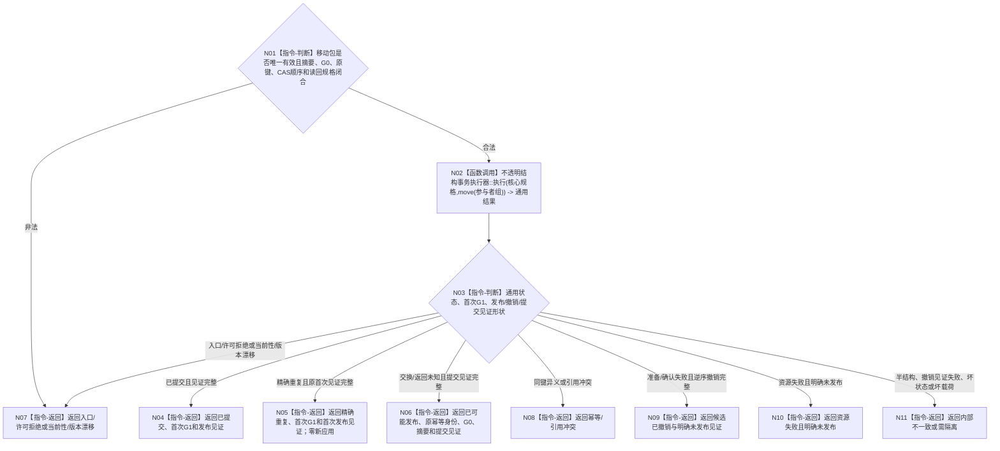

# BIZ-L4-003-04-04-02 执行合同建立预支统一事实写集目标函数流程图 v0.2

更新时间：2026-08-27

## 依据

```text
0050、4040、4050、6160
父图：BIZ-L3-003-04-04 v0.2；前置：BIZ-L4-003-04-04-01 v0.2
```

## 身份与边界

正式目标函数设计图。消费唯一移动事务包，经第一写前校验、全参与者准备/候选读回/确认、失败逆序撤销和最后发布形成一个合同建立事实代次；交换结果未知只返回可收敛见证。

## 函数合同

```text
根函数：服务合同数据操作::执行合同建立预支统一事实写集
归属模块 / 文件 / 目标分解深度：服务合同数据操作 / 海中鱼巣/领域/数据操作.服务合同.ixx / BIZ-L4
现有或待新增：待新增；复用4040不透明事务执行器
完整签名：合同建立写集执行结果 服务合同数据操作::执行合同建立预支统一事实写集(合同建立预支事务参与者组&& 参与者组) noexcept
参数：右值转移核心规格、参与者、各owner CAS代次、语义摘要、来源G0、原幂等身份和读回规格唯一所有权
返回结果：已提交/精确重复返回首次G1与发布见证；入口/许可拒绝、当前性/版本漂移、幂等/引用冲突、候选已撤销、资源失败、已可能发布或内部不一致结构化分账
被调函数流程图：4040通用事务执行器及参与者生命周期属于共享基础能力
```

## 流程图



## 节点合同

| 节点 | 类型 | 输入绑定 | 输出绑定 | 事实读写 | 后继条件 | 验证 |
| --- | --- | --- | --- | --- | --- | --- |
| N01 | 判断 | move-only事务包 | 可执行或入口拒绝 | 无 | 单次消费 | 空包、错序、错代、重复所有权 |
| N02—N03 | 调用 / 判断 | 核心规格与参与者 | 通用事务结果 | 准备、读回、确认、最后发布或撤销 | 第一写前唯一性/CAS复核 | 每阶段故障注入、最后交换未知 |
| N04—N06 | 返回 | 提交/重复/未知 | G1或提交见证 | 无新写入 | 重复零副作用；未知只原键收敛 | 首次G1、见证、摘要 |
| N07—N11 | 返回 | 明确非成功或内部异常 | 结构化结果 | 发布前零普通可读半结构 | 返回父图 | 撤销完成、明确未发布、需隔离 |

## 关键边界

- 合同、P0阶段、服务值状态动态、关系和幂等账只能在最后发布点共同可见；准备成功不等于发布成功。
- 发布前失败必须逆序撤销并证明未发布；不能证明时进入内部不一致/隔离，不得继续换键提交。
- 已可能发布不是成功载荷，也不是明确未发布；调用方只能按原幂等身份和提交见证执行正式读回收敛。
