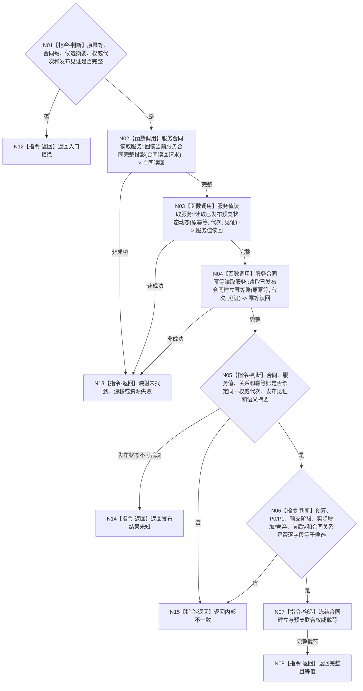

# BIZ-L4-003-04-04-03 联合读回已发布合同建立预支结果目标函数流程图 v0.1

更新时间：2026-08-03

## 依据

```text
0050、4040、6160；BIZ-L3-003-04-04；BIZ-L4-003-04-04-02
```

## 身份与边界

正式目标函数设计图。绑定原幂等身份、候选摘要、权威代次和发布见证，联合读回合同、预算、预支阶段、服务值状态动态、关系和幂等账并逐字段互证。

## 函数合同

```text
根函数：服务合同数据操作::联合读回已发布合同建立预支结果
归属模块 / 文件 / 层级：服务合同数据操作 / 海中鱼巣/领域/数据操作.服务合同.ixx / L4
现有或待新增：待新增组合读取；复用服务合同完整投影与服务值发布后只读服务
完整签名：合同建立联合读回结果 服务合同数据操作::联合读回已发布合同建立预支结果(const 合同建立联合读回请求& 请求) const noexcept
参数：请求为只读借用；含原幂等身份、合同唯一键、冻结候选摘要、权威代次、发布见证、持久证据状态和各提供者截止见证
返回结果：不可变值式结果；含完整且等值、未找到、版本漂移、发布结果未知、资源失败或内部不一致，以及合同完整投影、P0结算、服务值前后状态动态、关系、幂等账和联合见证
被调函数流程图：复用BIZ-L4-003-04-02-02合同完整投影读取；服务值与幂等发布后只读入口后续L5展开
父图：BIZ-L3-003-04-04
```

## 流程图



## 节点合同

| 节点 | 类型 | 参数 / 输入绑定 | 结果 / 输出绑定 | 事实读写 | 后继条件 | 验证 |
| --- | --- | --- | --- | --- | --- | --- |
| N02 | 函数调用 | 原合同键、代次和见证 | 合同完整投影 | 只读合同事实 | 唯一当前且完整 | 复用候选回读，不用索引证明完整 |
| N03/N04 | 函数调用 | 原幂等、代次和见证 | 服务值变化与幂等账 | 只读已发布事实 | 全部完整才互证 | P0只一次、舍弃不补领 |
| N05/N06 | 指令-判断 | 三组读回和候选 | 同代次与全字段等值性 | 无 | 完全等值才构造 | 不用最终V净值掩盖预支动态 |
| N07/N08/N12—N15 | 指令-构造 / 返回 | 已互证材料 | 联合载荷或非成功 | 无 | 返回父图 | 发布后矛盾进入审计/恢复 |

## 关键边界

联合读回只证明合同与30%预支同代次成立，不证明任务可以执行或生存安全根已经唤醒。后续完整秒才能消费已发布V执行安全根回归。
